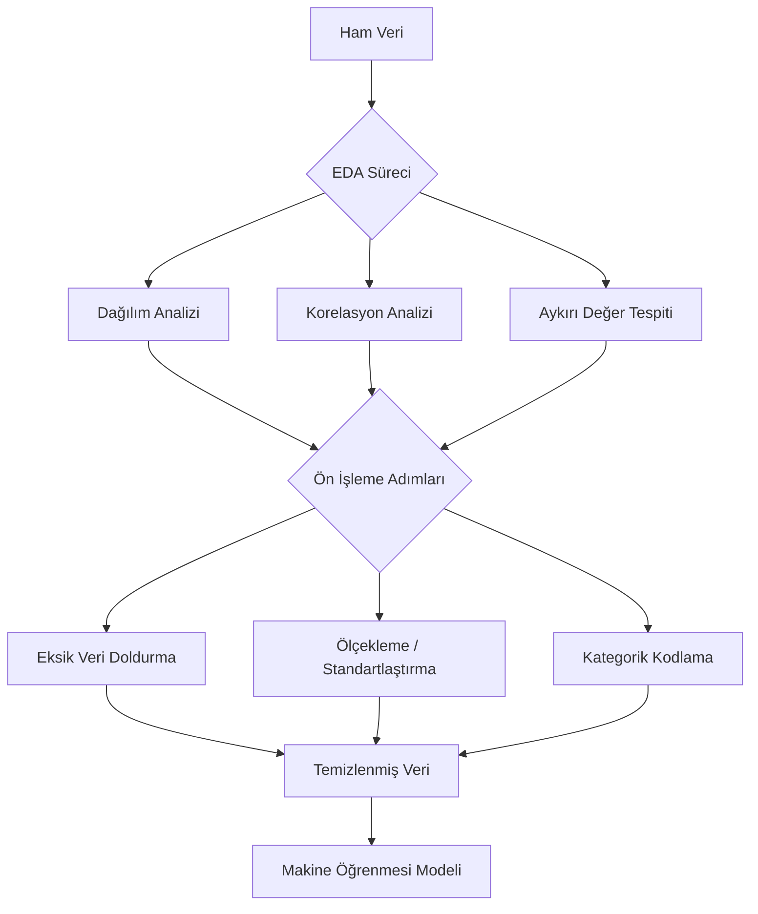
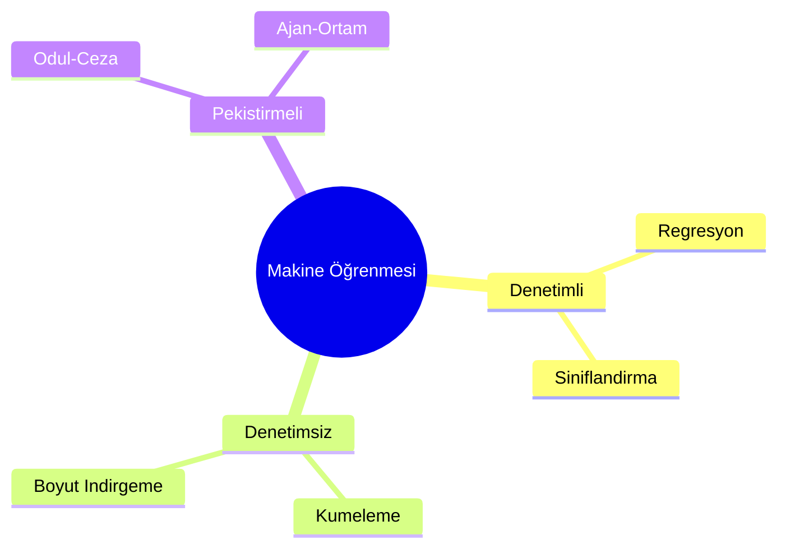
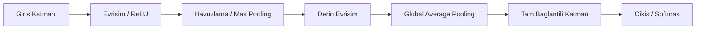
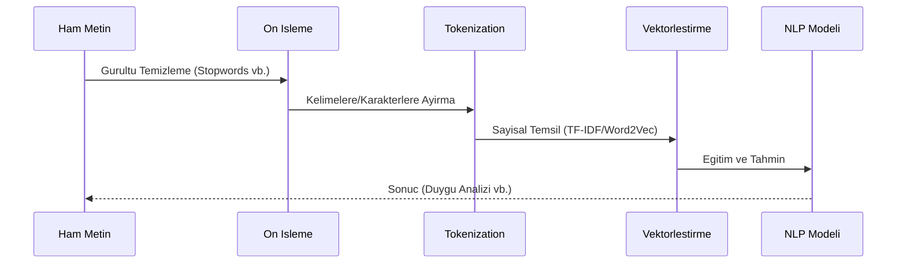

**YAPAY ZEKA TEMELLERİ**

Makine Öğrenmesi · Derin Öğrenme · NLP

Üniversite Düzeyi Kapsamlı Ders Notları

Python ile Uygulamalı Öğrenme

# **Ders İçeriği (Müfredat)**
---
  **Hafta**   **Konu**                          **Alt Başlıklar**
---
  1           Python'a Giriş                   Değişkenler, veri tipleri, koşullar, döngüler, fonksiyonlar

  2           NumPy & Pandas                    Diziler, DataFrame, veri okuma/yazma, gruplama

  3           Veri Görselleştirme & EDA         Matplotlib, Seaborn, Plotly; dağılım, korelasyon analizleri

  4           İstatistiksel Temel & Ön İşleme   Olasılık, istatistik, eksik veri, ölçekleme, encoding

  5           Makine Öğrenmesi Temelleri        Denetimli/denetimsiz öğrenme; model pipeline; bias-variance

  6           Regresyon Algoritmaları           Lineer, Polinom, Ridge, Lasso; değerlendirme metrikleri

  7           Sınıflandırma Algoritmaları       Lojistik, KNN, SVM, Karar Ağaçları, Random Forest

  8           Kümeleme & Boyut İndirgeme        K-Means, DBSCAN, PCA, t-SNE

  9           Derin Öğrenme Temelleri           YSA, aktivasyon fonksiyonları, geri yayılım, Keras/TF

  10          CNN - Görüntü İşleme              Evrişimli ağlar, havuzlama, transfer öğrenme

  11          RNN / LSTM - Sıralı Veriler       Tekrarlayan ağlar, LSTM, GRU, zaman serisi tahmini

  12          NLP Temelleri                     Tokenization, TF-IDF, Word2Vec, duygu analizi

  13          Transformer & BERT                Attention mekanizması, Hugging Face, fine-tuning

  14          Proje Sunumu & Özet               Tam pipeline, final proje, etik & gelecek trendler
---


> [!NOTE]
> **📌 Değerlendirme**
> Ara Sınav %40 | Final Projesi %60

# **BÖLÜM 1 --- Python'a Giriş**


> [!NOTE]
> **Bu Bölümün Hedefleri**
> Python ortamını kurmak; değişkenler, veri tipleri, koşullar, döngüler ve fonksiyonları öğrenmek; ilk YZ kodunu çalıştırmak.

## **1.1 Python Neden YZ için?**

Python, günümüzde yapay zeka ve makine öğrenmesi alanında en yaygın kullanılan programlama dilidir. Bunun temel nedenleri:

-   Okunabilir ve anlaşılır sözdizimi --- matematik formüllerine çok yakın

-   Devasa ekosistem --- NumPy, Pandas, TensorFlow, PyTorch, Scikit-learn gibi kütüphaneler

-   Topluluk desteği --- milyonlarca geliştirici, binlerce eğitim kaynağı

-   Jupyter Notebook --- veri analizi için interaktif çalışma ortamı

## **1.2 Kurulum**

### **Anaconda ile Kurulum (Önerilen)**

1.  https://www.anaconda.com adresinden Anaconda'yı indirin

2.  Kurulumu tamamlayın (Windows/Mac/Linux için ayrı sürümler mevcuttur)

3.  'Anaconda Navigator' veya terminali açın

4.  Jupyter Notebook'u başlatın: jupyter notebook

## **1.3 Değişkenler ve Veri Tipleri**

Python'da değişken tanımlamak için tip belirtmeye gerek yoktur. Python dinamik tip sistemine sahiptir.

**Python | Değişkenler ve Temel Veri Tipleri**

```python
# ── Tam Sayı (Integer) ──────────────────────────────────────

yas = 21 # int: tam sayı

print(type(yas)) # <class 'int'>

print(yas) # 21

# ── Ondalıklı Sayı (Float) ───────────────────────────────────

pi = 3.14159 # float: ondalıklı sayı

agirlik = 75.5

# ── Metin (String) ───────────────────────────────────────────

isim = "Yapay Zeka" # string: metin

ders = 'Makine Öğrenmesi' # tek veya çift tırnak kullanılabilir

# ── Mantıksal (Boolean) ──────────────────────────────────────

dogru = True # bool: True ya da False

yanlis = False

# ── Tip Dönüşümü ─────────────────────────────────────────────

metin_sayi = "42"

sayi = int(metin_sayi) # "42" → 42 (string → int)

ondalik = float(metin_sayi) # "42" → 42.0 (string → float)

metin = str(sayi) # 42 → "42" (int → string)

# ── Tip Kontrolü ─────────────────────────────────────────────

print(isinstance(yas, int)) # True

print(isinstance(pi, float)) # True

print(isinstance(isim, str)) # True
```

## **1.4 Listeler, Sözlükler ve Demetler**

**Python | Temel Veri Yapıları**

```python
# ── Liste (List) ─────────────────────────────────────────────

# Sıralı, değiştirilebilir veri koleksiyonu

meyveler = ["elma", "armut", "kiraz", "üzüm"]

print(meyveler[0]) # elma (ilk eleman, indeks 0'dan başlar)

print(meyveler[-1]) # üzüm (son eleman)

print(meyveler[1:3]) # ['armut', 'kiraz'] (dilimleme)

meyveler.append("mango") # sona ekle

meyveler.remove("elma") # sil

print(len(meyveler)) # eleman sayısı

# YZ'de sıkça kullanım: tahmin sonuçlarını listelemek

tahminler = [0, 1, 1, 0, 1, 0, 0, 1]

# ── Sözlük (Dictionary) ───────────────────────────────────────

# Anahtar-değer çiftleri, çok hızlı erişim

ogrenci = {

"ad" : "Ayşe",

"yas" : 22,

"not" : 85.5,

"gecti": True

}

print(ogrenci["ad"]) # Ayşe

print(ogrenci.get("not")) # 85.5

ogrenci["bolum"] = "BM" # yeni alan ekle

# YZ'de kullanım: model parametrelerini saklamak

model_params = {

"learning_rate": 0.001,

"epochs" : 50,

"batch_size" : 32

}

# ── Demet (Tuple) ─────────────────────────────────────────────

# Değiştirilemez (immutable) liste

koordinatlar = (41.01, 28.97) # enlem, boylam

print(koordinatlar[0]) # 41.01

# ── Küme (Set) ────────────────────────────────────────────────

# Tekrarsız elemanlar

sinif_etiketler = {0, 1, 2, 1, 0, 2}

print(sinif_etiketler) # {0, 1, 2} --- tekrarlar kaldırıldı
```

**[\
]{.mark}**

## **1.5 Koşullar (if/elif/else)**

**Python | Koşul İfadeleri**

```python
# ── Temel if/elif/else ───────────────────────────────────────

not_puani = 72

if not_puani >= 90:

harf = "AA"

print("Mükemmel!")

elif not_puani >= 80:

harf = "BA"

print("Çok İyi")

elif not_puani >= 70:

harf = "BB"

print("İyi")

elif not_puani >= 60:

harf = "CB"

print("Orta")

else:

harf = "FF"

print("Kaldı!")

print(f"Harf Notu: {harf}") # BB

# ── Mantıksal operatörler ─────────────────────────────────────

yas = 20

ogrenci_mi = True

if yas >= 18 and ogrenci_mi:

print("Öğrenci indirimi uygulanır")

# ── YZ Örneği: Tahmin Değerlendirme ──────────────────────────

gercek = 1 # gerçek etiket

tahmin = 1 # modelin tahmini

if gercek == tahmin:

print("✅ Doğru tahmin (True Positive/Negative)")

else:

print("❌ Yanlış tahmin (False Positive/Negative)")
```

## **1.6 Döngüler (for / while)**

**Python | Döngüler**

```python
# ── for döngüsü ──────────────────────────────────────────────

# Liste üzerinde iterasyon

hayvanlar = ["kedi", "köpek", "kuş"]

for hayvan in hayvanlar:

print(f"Hayvan: {hayvan}")

# range() ile sayısal döngü

for i in range(5): # 0, 1, 2, 3, 4

print(f"Adım {i}")

for i in range(1, 11, 2): # 1, 3, 5, 7, 9 (başlangıç, bitiş, adım)

print(i)

# ── enumerate: hem indeks hem değer ──────────────────────────

etiketler = ["kedi", "köpek", "kuş", "balık"]

for indeks, etiket in enumerate(etiketler):

print(f"Sınıf {indeks}: {etiket}")

# Sınıf 0: kedi

# Sınıf 1: köpek \...

# ── YZ Örneği: Epoch Döngüsü ──────────────────────────────────

epochs = 5

for epoch in range(1, epochs + 1):

# Bu gerçek eğitimde model.fit() çağrılır

kayip = 1.0 / epoch # örnek azalan kayıp

print(f"Epoch {epoch}/{epochs} --- Kayıp: {kayip:.4f}")

# ── while döngüsü ─────────────────────────────────────────────

sayac = 0

while sayac < 5:

print(f"Sayaç: {sayac}")

sayac += 1 # sayac = sayac + 1

# ── Liste Kavrama (List Comprehension) ────────────────────────

# Python'a özgü, kısa ve güçlü sözdizimi

kareler = [x**2 for x in range(1, 6)]

print(kareler) # [1, 4, 9, 16, 25]

# Koşullu list comprehension

cift_kareler = [x**2 for x in range(1, 11) if x % 2 == 0]

print(cift_kareler) # [4, 16, 36, 64, 100]
```

## **1.7 Fonksiyonlar**

Fonksiyonlar, tekrar kullanılabilir kod bloklarıdır. YZ'de her işlem (ön işleme, eğitim, değerlendirme) ayrı fonksiyonlara ayrılır.

**Python | Fonksiyon Tanımlama ve Kullanma**

```python
# ── Temel Fonksiyon ──────────────────────────────────────────

def selamla(isim):

"""

Verilen isme göre selamlama mesajı döndürür.

Args:

isim (str): Selamlanacak kişinin adı

Returns:

str: Selamlama mesajı

"""

mesaj = f"Merhaba, {isim}! Yapay Zeka dersine hoş geldiniz."

return mesaj

print(selamla("Ayşe")) # Merhaba, Ayşe! \...

# ── Varsayılan Parametre ──────────────────────────────────────

def kuvvet_al(sayi, us=2):

"""Sayının üssünü hesaplar. Varsayılan olarak karesi alınır."""

return sayi ** us

print(kuvvet_al(3)) # 9 (3²)

print(kuvvet_al(3, 3)) # 27 (3³)

# ── Birden Fazla Değer Döndürme ───────────────────────────────

def istatistik_hesapla(sayilar):

"""Liste için temel istatistikleri hesaplar."""

n = len(sayilar)

toplam = sum(sayilar)

ortalama = toplam / n

minimum = min(sayilar)

maksimum = max(sayilar)

return ortalama, minimum, maksimum # tuple olarak döner

notlar = [75, 88, 92, 65, 78, 83, 71]

ort, min_not, max_not = istatistik_hesapla(notlar)

print(f"Ortalama: {ort:.1f}, Min: {min_not}, Max: {max_not}")

# ── YZ'de Fonksiyon Örneği: Doğruluk Hesaplama ───────────────

def dogruluk_hesapla(gercekler, tahminler):

"""

Modelin doğruluk oranını hesaplar.

Args:

gercekler (list): Gerçek etiketler

tahminler (list): Model tahminleri

Returns:

float: 0 ile 1 arasında doğruluk oranı

"""

dogru_sayisi = sum(g == t for g, t in zip(gercekler, tahminler))

return dogru_sayisi / len(gercekler)

gercek = [1, 0, 1, 1, 0, 1, 0, 0]

tahmin = [1, 0, 1, 0, 0, 1, 1, 0]

dogruluk = dogruluk_hesapla(gercek, tahmin)

print(f"Model Doğruluğu: %{dogruluk * 100:.1f}") # %75.0
```

## **1.8 Hata Yönetimi (try/except)**

**Python | Hata Yakalama**

```python
# YZ kodu çalışırken çeşitli hatalar oluşabilir

# Bu hataları yakalamak programın çökmesini önler

def guvenli_bolum(a, b):

try:

sonuc = a / b

return sonuc

except ZeroDivisionError:

print("⚠️ Hata: Sıfıra bölme yapılamaz!")

return None

except TypeError:

print("⚠️ Hata: Sayısal değer giriniz!")

return None

print(guvenli_bolum(10, 2)) # 5.0

print(guvenli_bolum(10, 0)) # Uyarı mesajı + None

print(guvenli_bolum(10, "a")) # Uyarı mesajı + None
```

**── BÖLÜM 1 --- ALIŞTIRMALAR──**

## **Alıştırmalar**

5.  Kullanıcıdan bir not puanı alarak harf notunu yazdıran bir fonksiyon yazınız.

6.  1'den 100'e kadar olan sayılar içinden 3'e ve 5'e bölünebilenlerin listesini list comprehension ile oluşturunuz.

7.  Bir sınıfın notlarını içeren listeyi alıp; ortalama, medyan (manuel), standart sapma (manuel) hesaplayan fonksiyon yazınız.

8.  [ZORLAYICI] Fibonacci serisinin ilk n terimini hesaplayan ve hem liste hem sözlük formatında döndüren fonksiyon yazınız.

# **BÖLÜM 2 --- NumPy ve Pandas**


> [!NOTE]
> **Bu Bölümün Hedefleri**
> NumPy dizileriyle vektörel işlem yapmak; Pandas ile tablolu veri okumak, filtrelemek ve özetlemek; gerçek bir veri setini yükleyip incelemek.

## **2.1 NumPy --- Sayısal Hesaplama**

NumPy (Numerical Python), Python'da sayısal hesaplamalar için temel kütüphanedir. N boyutlu dizi (ndarray) yapısı sağlar ve makine öğrenmesinde veri matrisleri olarak kullanılır.

**Python | NumPy Temelleri**

```python
import numpy as np

# ── Dizi Oluşturma ────────────────────────────────────────────

a = np.array([1, 2, 3, 4, 5]) # 1B dizi

b = np.array([[1, 2, 3], # 2B dizi (matris)

[4, 5, 6],

[7, 8, 9]])

print(a.shape) # (5,) → 5 elemanlı 1 boyutlu

print(b.shape) # (3, 3) → 3x3 matris

print(b.dtype) # int64 → veri tipi

print(b.ndim) # 2 → boyut sayısı

# ── Özel Diziler ──────────────────────────────────────────────

sifirlar = np.zeros((3, 4)) # 3x4 sıfır matrisi

birler = np.ones((2, 5)) # 2x5 bir matrisi

kimlik = np.eye(3) # 3x3 birim matris

aralik = np.arange(0, 10, 2) # [0, 2, 4, 6, 8]

esit = np.linspace(0, 1, 5) # [0, 0.25, 0.50, 0.75, 1]

# ── Rastgele Diziler (YZ'de önemli: ağırlık başlatma) ────────

np.random.seed(42) # tekrar üretilebilirlik için!

rastgele = np.random.rand(3, 3) # 0-1 arası uniform

normal = np.random.randn(100) # standart normal dağılım

tamsayi = np.random.randint(0, 10, size=(5, 5)) # 0-9 arası tam sayı
```

**Python | NumPy --- Matematiksel İşlemler**

```python
import numpy as np

# Vektörize işlemler --- Python listelerinden ÇOK daha hızlı!

x = np.array([1, 2, 3, 4, 5])

y = np.array([10, 20, 30, 40, 50])

# ── Eleman bazlı aritmetik ────────────────────────────────────

print(x + y) # [11, 22, 33, 44, 55]

print(x * 2) # [2, 4, 6, 8, 10] --- broadcasting

print(x ** 2) # [1, 4, 9, 16, 25]

# ── İstatistiksel fonksiyonlar ────────────────────────────────

veriler = np.array([23, 45, 12, 67, 34, 89, 56, 78])

print(f"Ortalama : {np.mean(veriler):.2f}") # 50.50

print(f"Medyan : {np.median(veriler):.2f}") # 50.50

print(f"Std Sapma : {np.std(veriler):.2f}") # 25.62

print(f"Varyans : {np.var(veriler):.2f}") # 656.5

print(f"Min / Max : {veriler.min()} / {veriler.max()}")

# ── Matris İşlemleri (DL'de temel!) ──────────────────────────

A = np.array([[1, 2], [3, 4]])

B = np.array([[5, 6], [7, 8]])

print("Matris çarpımı:\\n", np.dot(A, B)) # veya A @ B

# [[19, 22],

# [43, 50]]

print("Transpoz:\\n", A.T)

print("Determinant:", np.linalg.det(A)) # -2.0

print("Ters matris:\\n", np.linalg.inv(A))

# ── Dilimleme ve İndeksleme ───────────────────────────────────

M = np.arange(1, 26).reshape(5, 5) # 5x5 matris

print(M[0, :]) # ilk satır

print(M[:, 2]) # 3. sütun

print(M[1:3, 1:3]) # alt matris (2x2)

# ── Mantıksal Maske (Boolean Indexing) ───────────────────────

# YZ'de filtreleme için çok kullanılır

notlar = np.array([55, 78, 92, 45, 63, 88, 71])

gecenler = notlar[notlar >= 60]

print(gecenler) # [78, 92, 63, 88, 71]
```

## **2.2 Pandas --- Veri Analizi**

Pandas, tablolu (satır-sütun) veriler için Python'un en güçlü kütüphanesidir. Excel gibi düşünebilirsiniz, ancak çok daha hızlı ve programlanabilir.

**Python | Pandas --- DataFrame Temel İşlemler**

```python
import pandas as pd

import numpy as np

# ── DataFrame Oluşturma ───────────────────────────────────────

veri = {

"isim" : ["Ali", "Ayşe", "Mehmet", "Fatma", "Can"],

"yas" : [23, 21, 25, 22, 24],

"not" : [78, 92, 65, 88, 71],

"bolum" : ["BM", "EE", "BM", "MD", "EE"],

"gecti" : [True, True, False, True, True]

}

df = pd.DataFrame(veri)

print(df)

# isim yas not bolum gecti

# 0 Ali 23 78 BM True

# 1 Ayşe 21 92 EE True

# \...

# ── Temel Bilgiler ────────────────────────────────────────────

print(df.shape) # (5, 5) → 5 satır, 5 sütun

print(df.dtypes) # her sütunun veri tipi

print(df.info()) # genel bilgi + bellek kullanımı

print(df.describe()) # sayısal sütunlar için istatistik

# ── Sütun Erişimi ─────────────────────────────────────────────

print(df["not"]) # tek sütun → Series

print(df[["isim", "not"]]) # birden fazla sütun → DataFrame

# ── Satır Erişimi ─────────────────────────────────────────────

print(df.iloc[0]) # iloc: indeks numarası ile (0. satır)

print(df.loc[2]) # loc: etiket/indeks ile (2. satır)

print(df.iloc[1:3]) # 1. ve 2. satırlar
```

**Python | Pandas --- Filtreleme ve Gruplama**

```python
import pandas as pd

# Örnek veri seti oluşturalım

import numpy as np

np.random.seed(0)

n = 100

df = pd.DataFrame({

"bolum" : np.random.choice(["BM","EE","MD","FZ"], n),

"cinsiyet": np.random.choice(["E","K"], n),

"not" : np.random.randint(45, 100, n),

"devamsiz": np.random.randint(0, 15, n)

})

# ── Filtreleme ────────────────────────────────────────────────

# Tek koşul

bm_df = df[df["bolum"] == "BM"]

# Çoklu koşul (& = ve, | = veya)

basarili = df[(df["not"] >= 60) & (df["devamsiz"] <= 7)]

print(f"Başarılı öğrenci: {len(basarili)}")

# ── Yeni Sütun Ekleme ─────────────────────────────────────────

df["harf_notu"] = df["not"].apply(lambda x:

"AA" if x >= 90 else

"BA" if x >= 80 else

"BB" if x >= 70 else

"CB" if x >= 60 else "FF"

)

# ── Gruplama (groupby) ────────────────────────────────────────

bolum_istatistik = df.groupby("bolum").agg(

ortalama_not = ("not", "mean"),

maks_not = ("not", "max"),

ogrenci_sayisi = ("not", "count")

).round(2)

print(bolum_istatistik)

# ── Eksik Veri Kontrolü ───────────────────────────────────────

print(df.isnull().sum()) # her sütundaki NaN sayısı

print(df.isnull().mean() * 100) # % olarak eksik oran

# ── CSV Okuma / Yazma ─────────────────────────────────────────

# df.to_csv("ogrenciler.csv", index=False)

# df_oku = pd.read_csv("ogrenciler.csv")

# df_excel = pd.read_excel("veri.xlsx", sheet_name="Sayfa1")
```

**── BÖLÜM 2 --- ALIŞTIRMALAR──**

## **Alıştırmalar**

9.  NumPy kullanarak 100 öğrencinin notunu simüle edin (normal dağılım, ortalama=70, std=10). Ortalama, medyan, standart sapma hesaplayın.

10. Pandas ile iris.csv veri setini yükleyip türlere göre (species) ortalama ölçümleri hesaplayın.

11. Aşağıdaki ham öğrenci veri setini temizleyin: eksik notları ortalama ile doldurun, aykırı değerleri tespit edin, harf notunu ekleyin.

12. [ZORLAYICI] İki farklı sınıfın not dağılımlarını karşılaştıran kapsamlı bir analiz yapın; t-test ile anlamlılık testini NumPy ile hesaplayın.

# **BÖLÜM 3 --- Keşifsel Veri Analizi (EDA) ve Görselleştirme**


> [!NOTE]
> **Bu Bölümün Hedefleri**
> Matplotlib ve Seaborn ile çeşitli grafikler oluşturmak; veri dağılımını, ilişkilerini ve aykırı değerleri görsel olarak tespit etmek; EDA sürecini uçtan uca uygulamak.

## **3.1 Keşifsel Veri Analizi Nedir?**

EDA (Exploratory Data Analysis), makine öğrenmesi modelini kurmadan önce veriyi anlamak için yapılan sistematik inceleme sürecidir. İyi bir EDA şunları kapsar:

-   Veri boyutu ve tipleri anlama

-   Eksik ve aykırı değerleri tespit etme

-   Değişkenler arası ilişkileri keşfetme

-   Hipotezler geliştirme

-   Ön işleme kararları almak

## **3.2 Matplotlib ile Temel Grafikler**

**Python | Matplotlib --- Çizgi, Çubuk, Dağılım Grafikleri**

```python
import matplotlib.pyplot as plt

import numpy as np

# ── Çizgi Grafiği (Model Eğitim Takibi) ──────────────────────

epochs = range(1, 21)

egitim_kayip = [0.95 - 0.04*i + 0.02*np.random.rand() for i in epochs]

dogrulama_kayip = [1.1 - 0.03*i + 0.03*np.random.rand() for i in epochs]

plt.figure(figsize=(10, 5))

plt.plot(epochs, egitim_kayip, 'b-o', label='Eğitim Kaybı', linewidth=2, markersize=5)

plt.plot(epochs, dogrulama_kayip, 'r\--s', label='Doğrulama Kaybı', linewidth=2, markersize=5)

plt.xlabel('Epoch', fontsize=12)

plt.ylabel('Kayıp (Loss)', fontsize=12)

plt.title('Model Eğitim ve Doğrulama Kaybı', fontsize=14, fontweight='bold')

plt.legend(fontsize=11)

plt.grid(True, alpha=0.3)

plt.tight_layout()

plt.savefig('egitim_kayip.png', dpi=150)

plt.show()

# ── Alt Grafikler (Subplots) ──────────────────────────────────

fig, axes = plt.subplots(2, 2, figsize=(12, 10))

# Grafik 1: Histogram

np.random.seed(42)

veri = np.random.normal(70, 15, 300)

axes[0,0].hist(veri, bins=20, color='steelblue', edgecolor='black', alpha=0.7)

axes[0,0].set_title('Not Dağılımı (Histogram)')

axes[0,0].set_xlabel('Not'); axes[0,0].set_ylabel('Frekans')

axes[0,0].axvline(np.mean(veri), color='red', linestyle='\--', label=f'Ort: {np.mean(veri):.1f}')

axes[0,0].legend()

# Grafik 2: Kutu Grafiği (Boxplot)

bolumler = ['BM', 'EE', 'MD', 'FZ']

veriler = [np.random.normal(m, 10, 50) for m in [72, 68, 75, 70]]

axes[0,1].boxplot(veriler, labels=bolumler, patch_artist=True,

boxprops=dict(facecolor='lightblue'))

axes[0,1].set_title('Bölümlere Göre Not Dağılımı (Boxplot)')

axes[0,1].set_ylabel('Not')

# Grafik 3: Çubuk Grafiği

kategoriler = ['Doğru Pozitif', 'Yanlış Pozitif', 'Yanlış Negatif', 'Doğru Negatif']

degerler = [85, 10, 5, 90]

renkler = ['green', 'orange', 'red', 'green']

axes[1,0].bar(kategoriler, degerler, color=renkler, alpha=0.7, edgecolor='black')

axes[1,0].set_title('Karmaşıklık Matrisi Sonuçları')

axes[1,0].set_ylabel('Sayı')

axes[1,0].tick_params(axis='x', rotation=20)

# Grafik 4: Saçılım Grafiği

x = np.random.randn(100)

y = 2*x + np.random.randn(100) * 0.5

axes[1,1].scatter(x, y, alpha=0.6, color='purple', s=40)

axes[1,1].set_title('Özellik Korelasyonu (Scatter)')

axes[1,1].set_xlabel('Özellik X'); axes[1,1].set_ylabel('Özellik Y')

plt.suptitle('EDA Görselleştirme Paneli', fontsize=16, fontweight='bold', y=1.02)

plt.tight_layout()

plt.show()
```

## **3.3 Seaborn ile İleri Görselleştirme**

**Python | Seaborn --- İstatistiksel Görselleştirme**

```python
import seaborn as sns

import matplotlib.pyplot as plt

import pandas as pd

import numpy as np

# Gerçek bir veri seti yükleyelim

df = sns.load_dataset("penguins").dropna()

# Sütunlar: species, island, bill_length_mm, bill_depth_mm,

# flipper_length_mm, body_mass_g, sex

# ── Korelasyon Isı Haritası ───────────────────────────────────

plt.figure(figsize=(8, 6))

sayisal = df.select_dtypes(include='number')

korelasyon = sayisal.corr()

sns.heatmap(korelasyon,

annot=True, # değerleri göster

fmt=".2f", # 2 ondalık

cmap="RdYlGn", # renk paleti

center=0, # 0'da ortalama

vmin=-1, vmax=1,

square=True,

linewidths=0.5)

plt.title('Özellikler Arası Korelasyon Matrisi', fontsize=14)

plt.tight_layout(); plt.show()

# ── Pair Plot (Çift Grafik) ───────────────────────────────────

sns.pairplot(df, hue="species", palette="husl",

plot_kws={"alpha": 0.6, "s": 30},

diag_kind="kde") # köşegen: yoğunluk grafiği

plt.suptitle('Penguen Özellikleri Çift Grafiği', y=1.02)

plt.show()

# ── Violin Plot ───────────────────────────────────────────────

plt.figure(figsize=(10, 6))

sns.violinplot(data=df, x="species", y="body_mass_g",

hue="sex", split=True,

palette={"Male": "steelblue", "Female": "salmon"})

plt.title('Türe ve Cinsiyete Göre Vücut Kütlesi Dağılımı')

plt.xlabel('Tür'); plt.ylabel('Vücut Kütlesi (g)')

plt.tight_layout(); plt.show()
```

## **3.4 Aykırı Değer Tespiti**

**Python | IQR ve Z-Score ile Aykırı Değer Tespiti**

```python
import numpy as np

import pandas as pd

import matplotlib.pyplot as plt

from scipy import stats

np.random.seed(42)

# Normal veri + yapay aykırı değerler

veri = np.concatenate([

np.random.normal(70, 10, 95), # 95 normal değer

[10, 5, 130, 145, 120] # 5 aykırı değer

])

# ── Yöntem 1: IQR (Çeyrekler Arası Açıklık) ──────────────────

Q1 = np.percentile(veri, 25)

Q3 = np.percentile(veri, 75)

IQR = Q3 - Q1

alt_sinir = Q1 - 1.5 * IQR

ust_sinir = Q3 + 1.5 * IQR

iqr_aykiri = veri[(veri < alt_sinir) | (veri > ust_sinir)]

print(f"IQR Sınırları: [{alt_sinir:.1f}, {ust_sinir:.1f}]")

print(f"Aykırı değerler: {iqr_aykiri}")

# ── Yöntem 2: Z-Score ─────────────────────────────────────────

z_skorlar = np.abs(stats.zscore(veri))

zscore_aykiri = veri[z_skorlar > 3] # |z| > 3 → aykırı

print(f"Z-Score aykırıları: {zscore_aykiri}")

# ── Görselleştirme ────────────────────────────────────────────

fig, axes = plt.subplots(1, 2, figsize=(12, 5))

axes[0].boxplot(veri, vert=True, patch_artist=True,

boxprops=dict(facecolor='lightblue', color='navy'),

flierprops=dict(marker='o', color='red', markersize=10))

axes[0].set_title('Boxplot --- Aykırı Değerler (Kırmızı Noktalar)')

axes[0].set_ylabel('Değer')

normal = veri[(veri >= alt_sinir) & (veri <= ust_sinir)]

aykiri = veri[(veri < alt_sinir) | (veri > ust_sinir)]

axes[1].scatter(range(len(normal)), normal, color='steelblue', alpha=0.6, label='Normal')

axes[1].scatter([0]*len(aykiri), aykiri, color='red', s=100, marker='X', label='Aykırı')

axes[1].set_title('Saçılım --- Normal vs Aykırı')

axes[1].legend()

plt.tight_layout(); plt.show()
```

**── BÖLÜM 3 --- ALIŞTIRMALAR──**

## **Alıştırmalar**

13. Titanic veri setini Seaborn'dan yükleyerek tam bir EDA yapın: eksik değerler, dağılımlar, hayatta kalma ile diğer değişkenler arasındaki ilişkiler.

14. 'tips' veri setinde hesap tutarı ile bahşiş arasındaki ilişkiyi görselleştirin; gün ve cinsiyete göre farklılaşıyor mu inceleyin.

15. Normal, Poisson ve Üstel dağılımdan 1000 örnek üretip yan yana histogram + KDE grafiği çizin; temel istatistikleri karşılaştırın.




# **BÖLÜM 4 --- İstatistik Temelleri ve Veri Ön İşleme**


> [!NOTE]
> **Bu Bölümün Hedefleri**
> Olasılık ve istatistik kavramlarını kavramak; eksik veri, ölçekleme, kodlama gibi ön işleme adımlarını uygulamak; scikit-learn Pipeline yapısını tanımak.

## **4.1 Olasılık Temelleri**

Makine öğrenmesinin büyük bir kısmı olasılık teorisine dayanır. Temel kavramlar:

-   P(A): A olayının olasılığı --- 0 ile 1 arasında

-   P(A|B): B koşullu A olasılığı --- Bayes'in temeli

-   P(A ∩ B) = P(A) × P(A|B): çarpım kuralı

-   P(A ∪ B) = P(A) + P(B) - P(A ∩ B): toplam kuralı

**Python | Olasılık Dağılımları**

```python
import numpy as np

import matplotlib.pyplot as plt

from scipy import stats

fig, axes = plt.subplots(2, 3, figsize=(15, 9))

x_surekli = np.linspace(-4, 4, 200)

x_kesikli = np.arange(0, 15)

# ── Normal (Gaussian) Dağılım ─────────────────────────────────

# YZ'de en sık karşılaşılan dağılım --- gürültü modellemesi

norm_pdf = stats.norm.pdf(x_surekli, loc=0, scale=1)

axes[0,0].plot(x_surekli, norm_pdf, 'b-', linewidth=2)

axes[0,0].fill_between(x_surekli, norm_pdf, alpha=0.3)

axes[0,0].axvline(0, color='red', linestyle='\--', label='Ortalama=0')

axes[0,0].set_title('Normal Dağılım N(0,1)'); axes[0,0].legend()

# ── Binom Dağılım ─────────────────────────────────────────────

# n denemede k başarı olasılığı

binom_pmf = stats.binom.pmf(x_kesikli, n=10, p=0.5)

axes[0,1].bar(x_kesikli, binom_pmf, color='steelblue', alpha=0.7, edgecolor='black')

axes[0,1].set_title('Binom Dağılım (n=10, p=0.5)')

axes[0,1].set_xlabel('Başarı Sayısı')

# ── Poisson Dağılım ───────────────────────────────────────────

# Birim zamanda olay sayısı (lambda=3)

poisson_pmf = stats.poisson.pmf(x_kesikli, mu=3)

axes[0,2].bar(x_kesikli, poisson_pmf, color='orange', alpha=0.7, edgecolor='black')

axes[0,2].set_title('Poisson Dağılım (λ=3)')

# ── Bayes Teoremi Görsel ──────────────────────────────────────

# P(Hasta|Test+) = P(Test+|Hasta) * P(Hasta) / P(Test+)

duyarlilik = 0.95 # P(Test+|Hasta)

ozguluk = 0.90 # P(Test-|Sağlıklı)

prevalans = np.linspace(0.001, 0.1, 100) # P(Hasta)

# P(Test+) = duyar.*preval. + (1-özg.)*(1-preval.)

p_test_pos = duyarlilik * prevalans + (1 - ozguluk) * (1 - prevalans)

ppv = (duyarlilik * prevalans) / p_test_pos # Pozitif Tahmin Değeri

axes[1,0].plot(prevalans*100, ppv*100, 'r-', linewidth=2)

axes[1,0].set_xlabel('Hastalık Prevalansı (%)')

axes[1,0].set_ylabel('Pozitif Tahmin Değeri (%)')

axes[1,0].set_title('Bayes: Prevalans vs PPV')

axes[1,0].grid(True, alpha=0.3)

plt.tight_layout(); plt.show()
```

## **4.2 Hipotez Testi**

**Python | t-Testi ve ANOVA**

```python
from scipy import stats

import numpy as np

# ── Bağımsız İki Örneklem t-Testi ────────────────────────────

# Soru: İki grup not ortalaması anlamlı farklı mı?

np.random.seed(42)

grup_A = np.random.normal(72, 12, 40) # A grubu notları

grup_B = np.random.normal(78, 10, 40) # B grubu notları

t_stat, p_deger = stats.ttest_ind(grup_A, grup_B)

print(f"t-istatistiği : {t_stat:.4f}")

print(f"p-değeri : {p_deger:.4f}")

alfa = 0.05

if p_deger < alfa:

print("✅ H0 REDDEDİLDİ: Gruplar arasında anlamlı fark var (p<0.05)")

else:

print("❌ H0 KABUL EDİLDİ: Anlamlı fark yok")

# ── Ki-Kare Bağımsızlık Testi ─────────────────────────────────

# Soru: Bölüm ile başarı durumu bağımsız mı?

gozlenen = np.array([

[50, 10], # BM: [geçti, kaldı]

[45, 15], # EE

[55, 5], # MD

])

chi2, p, dof, beklenen = stats.chi2_contingency(gozlenen)

print(f"\\nKi-Kare: {chi2:.3f}, p={p:.4f}, df={dof}")

if p < 0.05:

print("✅ Bölüm ile başarı durumu bağımlı (istatistiksel olarak anlamlı)")
```

## **4.3 Veri Ön İşleme (Preprocessing)**

Ham veri nadiren modele doğrudan verilebilir. Aşağıdaki adımlar neredeyse her YZ projesinde uygulanır:

**Python | Eksik Veri İşleme**

```python
import pandas as pd

import numpy as np

from sklearn.impute import SimpleImputer, KNNImputer

# Eksik veri içeren örnek veri seti

np.random.seed(0)

n = 100

df = pd.DataFrame({

"yas" : np.where(np.random.rand(n)<0.1, np.nan, np.random.randint(18,65,n)),

"maas" : np.where(np.random.rand(n)<0.15, np.nan, np.random.normal(5000,1500,n)),

"deneyim" : np.where(np.random.rand(n)<0.05, np.nan, np.random.randint(0,20,n)),

"bolum" : np.random.choice(["BM","EE","MD", np.nan], n),

"performans" : np.random.choice(["düşük","orta","yüksek"], n)

})

print("=== Eksik Veri Analizi ===")

print(df.isnull().sum())

print(df.isnull().mean().round(3) * 100, "\\n% eksik")

# ── Sayısal Eksik Veri Doldurma ───────────────────────────────

# Yöntem 1: Ortalama ile doldurma (basit ama yaygın)

imp_mean = SimpleImputer(strategy="mean")

df[["yas","maas","deneyim"]] = imp_mean.fit_transform(

df[["yas","maas","deneyim"]])

# Yöntem 2: KNN ile doldurma (daha akıllı)

# imp_knn = KNNImputer(n_neighbors=5)

# df[sayisal] = imp_knn.fit_transform(df[sayisal])

# ── Kategorik Eksik Veri ──────────────────────────────────────

df["bolum"].fillna(df["bolum"].mode()[0], inplace=True) # mod ile doldur

print("Eksik veri kaldı mı:", df.isnull().sum().sum()) # 0
```

**Python | Ölçekleme (Scaling)**

```python
from sklearn.preprocessing import StandardScaler, MinMaxScaler, RobustScaler

import numpy as np, matplotlib.pyplot as plt

np.random.seed(42)

X = np.column_stack([

np.random.normal(50, 15, 200), # yaş (0-100 arası)

np.random.normal(5000, 2000, 200), # maaş (çok farklı ölçek!)

np.random.normal(3, 1, 200) # yıl deneyim

])

# ── StandardScaler: Ortalama=0, Std=1 ────────────────────────

# Formül: z = (x - μ) / σ

# Ne zaman: SVM, Lojistik Regresyon, YSA için

scaler_std = StandardScaler()

X_std = scaler_std.fit_transform(X)

print("StandardScaler sonrası ortalama:", X_std.mean(axis=0).round(2)) # ≈ 0

print("StandardScaler sonrası std :", X_std.std(axis=0).round(2)) # ≈ 1

# ── MinMaxScaler: [0, 1] aralığı ─────────────────────────────

# Formül: x' = (x - min) / (max - min)

# Ne zaman: Görüntü işleme, RNN, aktivasyon için

scaler_mm = MinMaxScaler()

X_mm = scaler_mm.fit_transform(X)

print("\\nMinMaxScaler sonrası min:", X_mm.min(axis=0).round(2)) # ≈ 0

print("MinMaxScaler sonrası max:", X_mm.max(axis=0).round(2)) # ≈ 1

# ── RobustScaler: Aykırı değerlere dayanıklı ─────────────────

# Formül: x' = (x - Q2) / IQR --- medyan ve IQR kullanır

scaler_rob = RobustScaler()

X_rob = scaler_rob.fit_transform(X)

# ⚠️ ÖNEMLİ: fit() sadece eğitim verisine! test'e sadece transform()

# from sklearn.model_selection import train_test_split

# X_train, X_test = train_test_split(X, test_size=0.2)

# scaler.fit(X_train) # ← sadece train'e fit!

# X_train_s = scaler.transform(X_train)

# X_test_s = scaler.transform(X_test) # ← train'deki istatistikle
```

**Python | Kategorik Değişken Kodlama (Encoding)**

```python
import pandas as pd

from sklearn.preprocessing import LabelEncoder, OrdinalEncoder

from sklearn.preprocessing import OneHotEncoder

df = pd.DataFrame({

"renk" : ["kırmızı","mavi","yeşil","kırmızı","mavi"],

"boyut" : ["küçük","orta","büyük","büyük","küçük"],

"kalite" : ["düşük","orta","yüksek","orta","yüksek"],

"fiyat" : [10, 20, 35, 30, 15]

})

# ── Label Encoding: 2 kategorili veya sıralı değil ────────────

le = LabelEncoder()

df["renk_le"] = le.fit_transform(df["renk"])

# kırmızı→2, mavi→0, yeşil→1

print("Label Encode renk:", df["renk_le"].values)

# ── Ordinal Encoding: Sıralı kategoriler ─────────────────────

oe = OrdinalEncoder(categories=[["küçük","orta","büyük"],

["düşük","orta","yüksek"]])

df[["boyut_oe","kalite_oe"]] = oe.fit_transform(df[["boyut","kalite"]])

# küçük→0, orta→1, büyük→2 (sıra korunuyor)

# ── One-Hot Encoding: Nominal kategoriler ────────────────────

# Her kategori için ayrı sütun oluşturur --- çoklu sütun patlaması!

renk_ohe = pd.get_dummies(df["renk"], prefix="renk")

df = pd.concat([df, renk_ohe], axis=1)

print(df[["renk","renk_kırmızı","renk_mavi","renk_yeşil"]].to_string())
```

**── BÖLÜM 4 --- ALIŞTIRMALAR──**

## **Alıştırmalar**

16. Adult Census Income veri setini yükleyin. Eksik verileri belirtin, kategorik değişkenleri uygun şekilde encode edin, sayısal değişkenleri ölçekleyin.

17. Iris veri setinde özellikler arasındaki korelasyon matrisini hesaplayın ve yorumlayın. Hangi özellikler birbirine yakından ilişkili?

18. [ZORLAYICI] Tam bir ön işleme pipeline'ı tasarlayın: eksik doldurma, aykırı değer kırpma, ölçekleme, encoding --- sklearn Pipeline ile uygulayın.

# **BÖLÜM 5 --- Makine Öğrenmesi Temelleri**


> [!NOTE]
> **Bu Bölümün Hedefleri**
> Denetimli/denetimsiz/pekiştirmeli öğrenmeyi ayırt etmek; bias-variance dengesi ve çapraz doğrulamayı kavramak; ilk sklearn modelini kurmak.

## **5.1 Makine Öğrenmesi Türleri**
---
  **Tür**                            **Açıklama**                       **Örnek Algoritmalar**                    **Kullanım Durumu**
---
  Denetimli (Supervised)             Etiketli veri ile öğrenme          Lineer/Lojistik Regresyon, RF, SVM, YSA   Spam tespiti, fiyat tahmini

  Denetimsiz (Unsupervised)          Etiketsiz veri ile örüntü keşfi    K-Means, DBSCAN, PCA, Autoencoder         Müşteri segmentasyonu, anomali tespiti

  Yarı Denetimli (Semi-supervised)   Az etiketli + çok etiketsiz veri   Label Propagation, Self-training          Tıbbi görüntü analizi

  Pekiştirmeli (Reinforcement)       Ödül/ceza ile öğrenme              Q-Learning, PPO, DQN                      Oyun oynama, robot kontrolü
---



## **5.2 Model Geliştirme Adımları**

19. Problemi tanımla (regresyon mu, sınıflandırma mı, kümeleme mi?)

20. Veri topla ve keşfet (EDA)

21. Veriyi hazırla (ön işleme, feature engineering)

22. Veriyi böl: eğitim / doğrulama / test

23. Model seç ve eğit

24. Değerlendir (metrikler)

25. Hiperparametre ayarla (GridSearch, RandomSearch)

26. Test setinde son değerlendirme

27. Deployment (model kaydetme, API)

## **5.3 Bias - Variance Dengesi**

Bu kavram, neden modelinizin hem eğitim hem de yeni verilerde iyi çalışması gerektiğini açıklar:
---
  **Durum**                       **Eğitim Hatası**   **Test Hatası**   **Sorun**          **Çözüm**
---
  İdeal                           Düşük               Düşük             Yok                ---

  Yüksek Bias (Underfitting)      Yüksek              Yüksek            Model çok basit    Daha karmaşık model

  Yüksek Variance (Overfitting)   Düşük               Yüksek            Model ezberliyor   Regularizasyon, veri artırma
---

**Python | Eğitim/Test Bölme ve Çapraz Doğrulama**

```python
from sklearn.model_selection import (train_test_split,

KFold, StratifiedKFold, cross_val_score, cross_validate)

from sklearn.datasets import load_iris

from sklearn.tree import DecisionTreeClassifier

import numpy as np

# Veri yükle

iris = load_iris()

X, y = iris.data, iris.target

# ── Holdout: Tek Bölme ────────────────────────────────────────

X_train, X_test, y_train, y_test = train_test_split(

X, y,

test_size=0.2, # %20 test

random_state=42, # tekrar üretilebilirlik

stratify=y # her sınıftan eşit oranda al

)

print(f"Eğitim: {X_train.shape}, Test: {X_test.shape}")

print(f"Eğitim sınıf dağılımı: {np.bincount(y_train)}")

# ── K-Fold Çapraz Doğrulama ───────────────────────────────────

# k=5 → veriyi 5'e böl, sırayla her biri test seti olur

model = DecisionTreeClassifier(random_state=42)

kf = StratifiedKFold(n_splits=5, shuffle=True, random_state=42)

cv_sonuclar = cross_val_score(model, X, y, cv=kf, scoring='accuracy')

print(f"\\n5-Fold CV Doğrulukları: {cv_sonuclar.round(3)}")

print(f"Ortalama : {cv_sonuclar.mean():.3f}")

print(f"Std Sapma : {cv_sonuclar.std():.3f}")

print(f"95% CI : [{cv_sonuclar.mean()-2*cv_sonuclar.std():.3f}, "

f"{cv_sonuclar.mean()+2*cv_sonuclar.std():.3f}]")
```

## **5.4 Model Değerlendirme Metrikleri**

**Python | Sınıflandırma ve Regresyon Metrikleri**

```python
from sklearn.metrics import (accuracy_score, precision_score, recall_score,

f1_score, roc_auc_score, confusion_matrix,

mean_squared_error, mean_absolute_error, r2_score,

classification_report, ConfusionMatrixDisplay)

import matplotlib.pyplot as plt

import numpy as np

# ── Sınıflandırma Metrikleri ──────────────────────────────────

y_gercek = np.array([1,1,1,1,0,0,0,0,1,0])

y_tahmin = np.array([1,1,0,1,0,0,1,0,1,0])

print("=== Sınıflandırma Raporu ===")

print(f"Doğruluk (Accuracy) : {accuracy_score(y_gercek,y_tahmin):.3f}")

print(f"Kesinlik (Precision) : {precision_score(y_gercek,y_tahmin):.3f}")

print(f"Duyarlılık (Recall) : {recall_score(y_gercek,y_tahmin):.3f}")

print(f"F1 Skoru : {f1_score(y_gercek,y_tahmin):.3f}")

print()

print(classification_report(y_gercek, y_tahmin,

target_names=["Sınıf 0", "Sınıf 1"]))

# Karmaşıklık Matrisi

cm = confusion_matrix(y_gercek, y_tahmin)

disp = ConfusionMatrixDisplay(cm, display_labels=["Negatif","Pozitif"])

disp.plot(cmap='Blues'); plt.title('Karmaşıklık Matrisi'); plt.show()

# ── Regresyon Metrikleri ──────────────────────────────────────

y_gercek_r = np.array([3.5, 4.2, 5.1, 2.8, 6.0, 4.5])

y_tahmin_r = np.array([3.8, 4.0, 5.3, 2.5, 5.8, 4.9])

mse = mean_squared_error(y_gercek_r, y_tahmin_r)

rmse = np.sqrt(mse)

mae = mean_absolute_error(y_gercek_r, y_tahmin_r)

r2 = r2_score(y_gercek_r, y_tahmin_r)

print("\\n=== Regresyon Metrikleri ===")

print(f"MSE (Ortalama Kare Hata) : {mse:.4f}")

print(f"RMSE (Kök MSE) : {rmse:.4f}")

print(f"MAE (Ortalama Mutlak Hata): {mae:.4f}")

print(f"R² (Belirleme Katsayısı) : {r2:.4f}")
```

**── BÖLÜM 5 --- ALIŞTIRMALAR──**

## **Alıştırmalar**

28. Bir sınıflandırma modeli için farklı eşik değerlerinde (0.3, 0.5, 0.7) precision, recall, F1'i karşılaştırın. Precision-Recall eğrisini çizin.

29. Stratified 10-Fold CV ile Iris veri setinde Decision Tree modelinin 'max_depth' parametresini 1'den 10'a kadar test edin ve sonuçları görselleştirin.

# **BÖLÜM 6 --- Regresyon Algoritmaları**


> [!NOTE]
> **Bu Bölümün Hedefleri**
> Lineer, Polinom, Ridge ve Lasso regresyonları anlamak ve uygulamak; regularizasyon kavramını kavramak; model yorumlama yapabilmek.

## **6.1 Lineer Regresyon**

En basit regresyon modelidir. Giriş özellikleri ile sürekli çıktı arasında lineer bir ilişki varsayar.

Formül: ŷ = β₀ + β₁x₁ + β₂x₂ + \... + βₙxₙ

Amaç: Hata karelerinin toplamını (MSE) minimize etmek --- En Küçük Kareler Yöntemi.

**Python | Lineer Regresyon --- Ev Fiyatı Tahmini**

```python
from sklearn.linear_model import LinearRegression

from sklearn.model_selection import train_test_split

from sklearn.metrics import r2_score, mean_squared_error

from sklearn.datasets import fetch_california_housing

import numpy as np, matplotlib.pyplot as plt

# Veri yükle

housing = fetch_california_housing(as_frame=True)

df = housing.frame

# Sadece 2 özellik kullanalım (görselleştirme için)

X = df[["MedInc", "AveRooms"]].values # medyan gelir, oda sayısı

y = df["MedHouseVal"].values # ev değeri (hedef)

X_train, X_test, y_train, y_test = train_test_split(X, y, test_size=0.2, random_state=42)

# ── Model Eğitimi ─────────────────────────────────────────────

model = LinearRegression()

model.fit(X_train, y_train)

print("=== Model Katsayıları ===")

print(f"Kesme noktası (β₀): {model.intercept_:.4f}")

for ozellik, katsayi in zip(["MedInc","AveRooms"], model.coef_):

print(f" {ozellik}: β = {katsayi:.4f}")

# ── Tahmin ve Değerlendirme ───────────────────────────────────

y_pred = model.predict(X_test)

r2 = r2_score(y_test, y_pred)

rmse = np.sqrt(mean_squared_error(y_test, y_pred))

print(f"\\nR² Skoru : {r2:.4f} (1.0 mükemmel)")

print(f"RMSE : {rmse:.4f} (100,000\$ biriminde)")

# ── Görselleştirme: Gerçek vs Tahmin ─────────────────────────

plt.figure(figsize=(8, 6))

plt.scatter(y_test, y_pred, alpha=0.3, s=10, color='steelblue')

plt.plot([y.min(), y.max()], [y.min(), y.max()], 'r\--', lw=2, label='Mükemmel tahmin')

plt.xlabel('Gerçek Değer'); plt.ylabel('Tahmin Değeri')

plt.title(f'Lineer Regresyon: Gerçek vs Tahmin\\nR²={r2:.3f}, RMSE={rmse:.3f}')

plt.legend(); plt.tight_layout(); plt.show()
```

## **6.2 Polinom Regresyon**

**Python | Polinom Regresyon**

```python
from sklearn.preprocessing import PolynomialFeatures

from sklearn.linear_model import LinearRegression

from sklearn.pipeline import Pipeline

import numpy as np, matplotlib.pyplot as plt

# Doğrusal olmayan ilişki üretelim

np.random.seed(42)

X = np.sort(np.random.uniform(-3, 3, 60)).reshape(-1, 1)

y = 0.5*X.ravel()**3 - 2*X.ravel() + np.random.randn(60)*1.5

X_plot = np.linspace(-3, 3, 200).reshape(-1, 1)

plt.figure(figsize=(15, 4))

for i, derece in enumerate([1, 2, 5, 10], 1):

pipeline = Pipeline([

("poly", PolynomialFeatures(degree=derece, include_bias=False)),

("linreg", LinearRegression())

])

pipeline.fit(X, y)

y_plot = pipeline.predict(X_plot)

plt.subplot(1, 4, i)

plt.scatter(X, y, s=15, alpha=0.6, label='Veri')

plt.plot(X_plot, y_plot, 'r-', linewidth=2, label=f'Derece {derece}')

plt.title(f'Polinom Derece {derece}\\nR²={pipeline.score(X,y):.3f}')

plt.legend(fontsize=8)

plt.suptitle('Polinom Derecesi ve Overfitting İlişkisi', y=1.02)

plt.tight_layout(); plt.show()

# Derece 1: Underfitting | Derece 5-10: Overfitting riski
```

## **6.3 Ridge ve Lasso Regresyon (Regularizasyon)**

Regularizasyon, modelin aşırı uyum (overfitting) yapmasını engeller.
---
  **Yöntem**     **Ceza Terimi**         **Özellik**                        **Ne Zaman?**
---
  Ridge (L2)     λ Σβ²                   Katsayıları küçültür, sıfırlamaz   Çok sayıda özellik, çoklu doğrusallık

  Lasso (L1)     λ Σ|β|                Bazı katsayıları tam 0 yapar       Özellik seçimi gerektiğinde

  ElasticNet     λ(αΣ|β| + (1-α)Σβ²)   Ridge + Lasso karışımı             İkisinin avantajlarına ihtiyaç duyulduğunda
---

**Python | Ridge, Lasso, ElasticNet Karşılaştırma**

```python
from sklearn.linear_model import Ridge, Lasso, ElasticNet

from sklearn.model_selection import cross_val_score

from sklearn.datasets import fetch_california_housing

from sklearn.preprocessing import StandardScaler

import numpy as np

housing = fetch_california_housing()

X, y = housing.data, housing.target

scaler = StandardScaler()

X_s = scaler.fit_transform(X)

modeller = {

"Lineer Regresyon": LinearRegression(),

"Ridge (α=1.0)" : Ridge(alpha=1.0),

"Ridge (α=10.0)" : Ridge(alpha=10.0),

"Lasso (α=0.1)" : Lasso(alpha=0.1),

"ElasticNet" : ElasticNet(alpha=0.1, l1_ratio=0.5),

}

print(f"{'Model':<25} {'R² Ort':>8} {'R² Std':>8}")

print("-" * 45)

for isim, model in modeller.items():

skorlar = cross_val_score(model, X_s, y, cv=5, scoring='r2')

print(f"{isim:<25} {skorlar.mean():>8.4f} {skorlar.std():>8.4f}")
```

**── BÖLÜM 6 --- ALIŞTIRMALAR──**

## **Alıştırmalar**

30. Diabetes veri setini kullanarak tüm özellikleri regresyon modeline ekleyin. En önemli özellikleri Ridge/Lasso ile belirleyin.

31. Boston Housing veri seti üzerinde LinReg, Ridge, Lasso, ElasticNet'i karşılaştırın. Alpha değerlerini farklı deneyin.

32. [PROJE HAZIRLIĞI] Gerçek bir veri seti seçerek uçtan uca bir regresyon analizi yapın: EDA → ön işleme → modelleme → değerlendirme → yorum.

# **BÖLÜM 7 --- Sınıflandırma Algoritmaları**


> [!NOTE]
> **Bu Bölümün Hedefleri**
> Lojistik regresyon, KNN, SVM, Karar Ağaçları ve Random Forest algoritmalarını kavramak; her birini uygulamalı olarak karşılaştırmak.

## **7.1 Lojistik Regresyon**

Adında 'regresyon' geçse de bir sınıflandırma algoritmasıdır. Sigmoid fonksiyonu ile 0-1 arası olasılık üretir.

**Python | Lojistik Regresyon --- İkili Sınıflandırma**

```python
from sklearn.linear_model import LogisticRegression

from sklearn.datasets import make_classification

from sklearn.model_selection import train_test_split

from sklearn.metrics import classification_report, roc_auc_score, roc_curve

from sklearn.preprocessing import StandardScaler

import matplotlib.pyplot as plt, numpy as np

# Yapay ikili sınıflandırma verisi

X, y = make_classification(

n_samples=1000, n_features=20, n_informative=10,

n_redundant=5, random_state=42

)

X_train, X_test, y_train, y_test = train_test_split(X, y, test_size=0.2, random_state=42)

scaler = StandardScaler()

X_train_s = scaler.fit_transform(X_train)

X_test_s = scaler.transform(X_test)

# ── Model Eğitimi ─────────────────────────────────────────────

lr = LogisticRegression(C=1.0, max_iter=200, random_state=42)

lr.fit(X_train_s, y_train)

# Olasılık tahmini (sınıf 1 için)

y_prob = lr.predict_proba(X_test_s)[:, 1]

y_pred = lr.predict(X_test_s)

print(classification_report(y_test, y_pred))

print(f"ROC-AUC: {roc_auc_score(y_test, y_prob):.4f}")

# ── ROC Eğrisi ────────────────────────────────────────────────

fpr, tpr, thresholds = roc_curve(y_test, y_prob)

auc = roc_auc_score(y_test, y_prob)

plt.figure(figsize=(7, 6))

plt.plot(fpr, tpr, 'b-', linewidth=2, label=f'LR (AUC={auc:.3f})')

plt.plot([0,1], [0,1], 'k\--', label='Rastgele Sınıflandırıcı')

plt.xlabel('Yanlış Pozitif Oranı (FPR)')

plt.ylabel('Doğru Pozitif Oranı (TPR)')

plt.title('ROC Eğrisi')

plt.legend(); plt.grid(True, alpha=0.3); plt.show()
```

## **7.2 Karar Ağaçları ve Random Forest**

**Python | Random Forest --- Güçlü Topluluk Yöntemi**

```python
from sklearn.ensemble import RandomForestClassifier, GradientBoostingClassifier

from sklearn.tree import DecisionTreeClassifier, plot_tree

from sklearn.datasets import load_breast_cancer

from sklearn.model_selection import train_test_split

from sklearn.metrics import classification_report

import matplotlib.pyplot as plt, numpy as np

# Göğüs kanseri teşhis veri seti

veri = load_breast_cancer()

X, y = veri.data, veri.target

ozellikler = veri.feature_names

X_train, X_test, y_train, y_test = train_test_split(X, y, test_size=0.2,

stratify=y, random_state=42)

# ── Karar Ağacı (tek ağaç) ────────────────────────────────────

dt = DecisionTreeClassifier(max_depth=4, random_state=42)

dt.fit(X_train, y_train)

# Ağacı görselleştir

plt.figure(figsize=(20, 10))

plot_tree(dt, feature_names=ozellikler, class_names=veri.target_names,

filled=True, fontsize=9, max_depth=3)

plt.title('Karar Ağacı (max_depth=4, ilk 3 seviye gösteriliyor)')

plt.savefig('karar_agaci.png', bbox_inches='tight', dpi=100)

plt.show()

# ── Random Forest (birçok ağaç → oylama) ─────────────────────

rf = RandomForestClassifier(

n_estimators=100, # 100 ağaç

max_depth=None, # tam gelişme izni

min_samples_split=5,

random_state=42,

n_jobs=-1 # tüm CPU çekirdeklerini kullan

)

rf.fit(X_train, y_train)

print("=== Random Forest Sonuçları ===")

print(classification_report(y_test, rf.predict(X_test),

target_names=veri.target_names))

# ── Özellik Önemi ─────────────────────────────────────────────

importances = rf.feature_importances_

indices = np.argsort(importances)[::-1][:15] # ilk 15

plt.figure(figsize=(10, 6))

plt.barh(range(15), importances[indices][::-1], color='steelblue', alpha=0.8)

plt.yticks(range(15), [ozellikler[i] for i in indices[::-1]])

plt.xlabel('Özellik Önemi (Gini Azalması)')

plt.title('Random Forest --- Özellik Önem Sıralaması')

plt.tight_layout(); plt.show()
```

## **7.3 Destek Vektör Makineleri (SVM)**

**Python | SVM ile Çok Sınıflı Sınıflandırma**

```python
from sklearn.svm import SVC

from sklearn.preprocessing import StandardScaler

from sklearn.pipeline import Pipeline

from sklearn.model_selection import GridSearchCV

from sklearn.datasets import load_digits

from sklearn.metrics import accuracy_score

# El yazısı rakam tanıma (10 sınıf)

digits = load_digits()

X, y = digits.data, digits.target

X_train, X_test, y_train, y_test = train_test_split(

X, y, test_size=0.2, random_state=42, stratify=y)

# ── SVM Pipeline ──────────────────────────────────────────────

svm_pipe = Pipeline([

("scaler", StandardScaler()),

("svm", SVC(kernel="rbf", C=10, gamma="scale", probability=True))

])

# ── Hiperparametre Arama ──────────────────────────────────────

param_grid = {

"svm__C" : [0.1, 1, 10, 100],

"svm__kernel": ["rbf", "linear"],

}

grid = GridSearchCV(svm_pipe, param_grid, cv=5, scoring="accuracy",

n_jobs=-1, verbose=1)

grid.fit(X_train, y_train)

print(f"En iyi parametreler: {grid.best_params_}")

print(f"CV doğruluğu : {grid.best_score_:.4f}")

print(f"Test doğruluğu : {accuracy_score(y_test, grid.predict(X_test)):.4f}")
```

**── BÖLÜM 7 --- ALIŞTIRMALAR──**

## **Alıştırmalar**

33. Titanic veri setinde hayatta kalma tahmini için Lojistik Regresyon, Random Forest, SVM karşılaştırın. En iyi modeli GridSearch ile optimize edin.

34. MNIST el yazısı rakam setinde (load_digits) KNN, SVM ve Random Forest ile sınıflandırma yapın. Karışıklık matrisini 10x10 boyutlu görselleştirin.

35. [PROJE] Kendi seçtiğiniz gerçek bir sınıflandırma problemi üzerinde uçtan uca makine öğrenmesi sürecini uygulayın.

# **BÖLÜM 8 --- Kümeleme ve Boyut İndirgeme**


> [!NOTE]
> **Bu Bölümün Hedefleri**
> K-Means ve DBSCAN kümeleme algoritmalarını uygulamak; PCA ve t-SNE ile yüksek boyutlu veriyi görselleştirmek; denetimsiz öğrenme değerlendirme metriklerini öğrenmek.

## **8.1 K-Means Kümeleme**

**Python | K-Means --- Müşteri Segmentasyonu**

```python
from sklearn.cluster import KMeans

from sklearn.preprocessing import StandardScaler

from sklearn.metrics import silhouette_score, davies_bouldin_score

import numpy as np, matplotlib.pyplot as plt, pandas as pd

# Simüle müşteri verisi

np.random.seed(42)

n = 300

musteri = pd.DataFrame({

"yillik_harcama" : np.concatenate([

np.random.normal(2000, 300, 100), # düşük harcama grubu

np.random.normal(5000, 500, 100), # orta harcama

np.random.normal(9000, 700, 100) # yüksek harcama

]),

"siparis_sikligi" : np.concatenate([

np.random.normal(5, 2, 100),

np.random.normal(15, 3, 100),

np.random.normal(30, 5, 100)

])

})

scaler = StandardScaler()

X = scaler.fit_transform(musteri)

# ── Elbow Yöntemi: Optimal K Seçimi ──────────────────────────

inertia = []

silhouette = []

k_araligi = range(2, 11)

for k in k_araligi:

km = KMeans(n_clusters=k, random_state=42, n_init=10)

km.fit(X)

inertia.append(km.inertia_)

silhouette.append(silhouette_score(X, km.labels_))

fig, axes = plt.subplots(1, 2, figsize=(12, 5))

axes[0].plot(k_araligi, inertia, 'b-o', linewidth=2)

axes[0].set_title("Elbow Yöntemi (Optimal K)"); axes[0].set_xlabel("K Değeri"); axes[0].set_ylabel("Inertia")

axes[1].plot(k_araligi, silhouette, 'r-o', linewidth=2)

axes[1].set_title("Silhouette Skoru (↑ iyi)"); axes[1].set_xlabel("K Değeri")

plt.tight_layout(); plt.show()

# ── K=3 ile Final Model ───────────────────────────────────────

km_final = KMeans(n_clusters=3, random_state=42, n_init=10)

musteri["kume"] = km_final.fit_predict(X)

print("=== Küme Analizi ===")

print(musteri.groupby("kume").agg(["mean","count"]).round(1))
```

## **8.2 DBSCAN --- Yoğunluk Tabanlı Kümeleme**

**Python | DBSCAN --- Gürültüye Dayanıklı Kümeleme**

```python
from sklearn.cluster import DBSCAN

from sklearn.datasets import make_moons, make_circles

import matplotlib.pyplot as plt

# K-Means'in başaramadığı şekilli veriler

fig, axes = plt.subplots(2, 2, figsize=(12, 10))

for i, (X, baslik) in enumerate([

make_moons(n_samples=300, noise=0.1, random_state=42),

make_circles(n_samples=300, noise=0.05, factor=0.5, random_state=42)

]):

# K-Means (sıra 0)

km_lbls = KMeans(n_clusters=2, random_state=42).fit_predict(X)

axes[i, 0].scatter(X[:,0], X[:,1], c=km_lbls, cmap='viridis', s=20, alpha=0.7)

axes[i, 0].set_title(f"K-Means --- {baslik}")

# DBSCAN (sıra 1)

db = DBSCAN(eps=0.3, min_samples=10)

db_lbls = db.fit_predict(X)

n_kume = len(set(db_lbls)) - (1 if -1 in db_lbls else 0)

n_gurultu = list(db_lbls).count(-1)

renkler = db_lbls.copy().astype(float)

axes[i, 1].scatter(X[:,0], X[:,1], c=db_lbls, cmap='plasma', s=20, alpha=0.7)

axes[i, 1].set_title(f"DBSCAN --- {n_kume} küme, {n_gurultu} gürültü")

plt.suptitle("K-Means vs DBSCAN", fontsize=14, fontweight='bold')

plt.tight_layout(); plt.show()
```

## **8.3 PCA --- Temel Bileşen Analizi**

**Python | PCA ile Boyut İndirgeme ve Görselleştirme**

```python
from sklearn.decomposition import PCA

from sklearn.preprocessing import StandardScaler

from sklearn.datasets import load_breast_cancer

import matplotlib.pyplot as plt, numpy as np

veri = load_breast_cancer()

X, y = veri.data, veri.target # 30 özellik → 2 boyuta indir

scaler = StandardScaler()

X_s = scaler.fit_transform(X)

# ── Açıklanan Varyans ─────────────────────────────────────────

pca_full = PCA(n_components=None)

pca_full.fit(X_s)

aciklanan_var = np.cumsum(pca_full.explained_variance_ratio_)

plt.figure(figsize=(10, 4))

plt.subplot(1,2,1)

plt.plot(aciklanan_var, 'b-o', linewidth=2)

plt.axhline(0.95, color='red', linestyle='\--', label='%95 varyans')

plt.xlabel('Bileşen Sayısı'); plt.ylabel('Kümülatif Açıklanan Varyans')

plt.title('PCA: Kaç Bileşen Gerekli?'); plt.legend(); plt.grid(True)

# ── 2D Görselleştirme ─────────────────────────────────────────

pca_2d = PCA(n_components=2)

X_2d = pca_2d.fit_transform(X_s)

print(f"2 bileşen açıklanan varyans: %{sum(pca_2d.explained_variance_ratio_)*100:.1f}")

plt.subplot(1,2,2)

for sinif, isim, renk in zip([0,1], veri.target_names, ['red','blue']):

maske = y == sinif

plt.scatter(X_2d[maske,0], X_2d[maske,1], label=isim,

alpha=0.6, s=20, color=renk)

plt.xlabel(f'PC1 (%{pca_2d.explained_variance_ratio_[0]*100:.1f})')

plt.ylabel(f'PC2 (%{pca_2d.explained_variance_ratio_[1]*100:.1f})')

plt.title('PCA: 2B Projeksiyon'); plt.legend()

plt.tight_layout(); plt.show()
```

**── BÖLÜM 8 --- ALIŞTIRMALAR──**

## **Alıştırmalar**

36. Mall Customer Segmentation veri seti üzerinde K-Means uygulayın; elbow ve silhouette yöntemleriyle optimal K'yı belirleyin; kümeleri yorumlayın.

37. MNIST veri setini t-SNE ile 2 boyuta indirgeyin ve görselleştirin. PCA ile karşılaştırın. Hangi yöntem daha net kümeler oluşturdu?

# **BÖLÜM 9 --- Derin Öğrenme Temelleri**


> [!NOTE]
> **Bu Bölümün Hedefleri**
> Yapay sinir ağlarının çalışma prensibini anlamak; aktivasyon fonksiyonlarını karşılaştırmak; Keras ile ilk derin öğrenme modelini kurmak ve eğitmek.

## **9.1 Yapay Sinir Ağları --- Teori**

Yapay sinir ağları, insan beynindeki nöron yapısından ilham alınarak geliştirilmiştir. Temel kavramlar:
---
  **Bileşen**        **Açıklama**                                              **Matematiksel İfade**
---
  Nöron (Düğüm)      Girdilerin ağırlıklı toplamını alır, aktivasyon uygular   z = Σ(wᵢxᵢ) + b

  Ağırlık (Weight)   Bağlantı gücü; eğitimle güncellenir                       w (başlangıçta rastgele)

  Bias               Nörona sabit bir ofset ekler                              b (esneklik sağlar)

  Aktivasyon         Doğrusal olmayanlık ekler                                 σ(z) = 1/(1+e⁻ᶻ) (sigmoid)

  İleri Besleme      Girdi → çıktı yönünde hesaplama                           ŷ = σ(W²·σ(W¹x+b¹)+b²)

  Geri Yayılım       Hata → ağırlık güncellemesi                               ∂L/∂w = zincir kuralı
---

## **9.2 Aktivasyon Fonksiyonları**

**Python | Aktivasyon Fonksiyonları Karşılaştırma**

```python
import numpy as np

import matplotlib.pyplot as plt

x = np.linspace(-5, 5, 200)

def sigmoid(x):

return 1 / (1 + np.exp(-x))

def tanh(x):

return np.tanh(x)

def relu(x):

return np.maximum(0, x)

def leaky_relu(x, alpha=0.1):

return np.where(x > 0, x, alpha * x)

def swish(x):

return x * sigmoid(x)

aktivasyonlar = {

"Sigmoid": (sigmoid(x), "Çıktı: (0,1)\\nSorun: Vanishing gradient"),

"Tanh": (tanh(x), "Çıktı: (-1,1)\\nDaha iyi ortalama=0"),

"ReLU": (relu(x), "En yaygın\\nÖlü nöron riski (x<0 için 0)"),

"Leaky ReLU": (leaky_relu(x), "x<0 için küçük eğim\\nÖlü nöron çözümü"),

"Swish": (swish(x), "Google'ın önerisi\\nReLU'dan iyi performans"),

}

fig, axes = plt.subplots(1, 5, figsize=(20, 4))

for ax, (isim, (y, aciklama)) in zip(axes, aktivasyonlar.items()):

ax.plot(x, y, 'b-', linewidth=2.5)

ax.axhline(0, color='k', linewidth=0.5)

ax.axvline(0, color='k', linewidth=0.5)

ax.set_title(f"{isim}\\n{aciklama}", fontsize=9)

ax.set_xlim(-5, 5); ax.grid(True, alpha=0.3)

plt.suptitle("Aktivasyon Fonksiyonları", fontsize=14, y=1.02)

plt.tight_layout(); plt.show()
```

## **9.3 Keras ile İlk Derin Öğrenme Modeli**

**Python | Keras --- Tam Bağlantılı Ağ (MNIST)**

```python
import tensorflow as tf

from tensorflow import keras

from tensorflow.keras import layers

import numpy as np, matplotlib.pyplot as plt

# ── Veri Yükleme ve Hazırlama ─────────────────────────────────

(X_train, y_train), (X_test, y_test) = keras.datasets.mnist.load_data()

print(f"Eğitim: {X_train.shape} --- Test: {X_test.shape}")

# Eğitim: (60000, 28, 28) --- Test: (10000, 28, 28)

# Normalizasyon: 0-255 → 0-1 arası

X_train = X_train.astype("float32") / 255.0

X_test = X_test.astype("float32") / 255.0

# Flatten: 28x28 → 784

X_train_flat = X_train.reshape(-1, 784)

X_test_flat = X_test.reshape(-1, 784)

# ── Model Mimarisi ────────────────────────────────────────────

model = keras.Sequential([

layers.Input(shape=(784,)),

layers.Dense(512, activation="relu"),

layers.Dropout(0.3), # %30 nöronu rastgele kapat → overfitting önleme

layers.Dense(256, activation="relu"),

layers.Dropout(0.2),

layers.Dense(128, activation="relu"),

layers.Dense(10, activation="softmax") # 10 rakam sınıfı

], name="MNIST_YSA")

model.summary()

# Toplam parametre sayısını gösterir

# ── Derleme ───────────────────────────────────────────────────

model.compile(

optimizer=keras.optimizers.Adam(learning_rate=0.001),

loss="sparse_categorical_crossentropy", # tam sayı etiket

metrics=["accuracy"]

)

# ── Eğitim ────────────────────────────────────────────────────

# Callbacks: erken durdurma + en iyi modeli kaydetme

callbacks = [

keras.callbacks.EarlyStopping(patience=5, restore_best_weights=True,

monitor="val_loss"),

keras.callbacks.ReduceLROnPlateau(factor=0.5, patience=3, verbose=1),

]

gecmis = model.fit(

X_train_flat, y_train,

epochs=20,

batch_size=128,

validation_split=0.15, # %15 doğrulama

callbacks=callbacks,

verbose=1

)

# ── Değerlendirme ─────────────────────────────────────────────

test_kayip, test_dogruluk = model.evaluate(X_test_flat, y_test, verbose=0)

print(f"\\nTest Kaybı : {test_kayip:.4f}")

print(f"Test Doğruluğu: {test_dogruluk*100:.2f}%")

# ── Eğitim Grafiği ────────────────────────────────────────────

fig, axes = plt.subplots(1, 2, figsize=(12, 5))

axes[0].plot(gecmis.history['loss'], label='Eğitim Kaybı')

axes[0].plot(gecmis.history['val_loss'], label='Doğrulama Kaybı')

axes[0].set_title('Kayıp (Loss) Eğrisi')

axes[0].set_xlabel('Epoch'); axes[0].set_ylabel('Kayıp'); axes[0].legend()

axes[1].plot(gecmis.history['accuracy'], label='Eğitim Doğruluğu')

axes[1].plot(gecmis.history['val_accuracy'], label='Doğrulama Doğruluğu')

axes[1].set_title('Doğruluk (Accuracy) Eğrisi')

axes[1].set_xlabel('Epoch'); axes[1].set_ylabel('Doğruluk'); axes[1].legend()

plt.tight_layout(); plt.show()
```

**── BÖLÜM 9 --- ALIŞTIRMALAR──**

## **Alıştırmalar**

38. Fashion MNIST veri seti üzerinde 4 farklı ağ mimarisi deneyin (katman sayısı, nöron sayısı, aktivasyon). Sonuçları karşılaştırın.

39. Batch size (32, 64, 128, 256) ve learning rate (0.1, 0.01, 0.001, 0.0001) kombinasyonlarını deneyin; her birinin eğitim seyrini karşılaştırın.

40. [PROJE] Kendi seçtiğiniz bir veri seti üzerinde tam bağlantılı YSA modeli kurun; overfitting sorununu Dropout ile çözmeye çalışın.




# **BÖLÜM 10 --- CNN: Evrişimli Sinir Ağları**


> [!NOTE]
> **Bu Bölümün Hedefleri**
> Evrişim ve havuzlama işlemlerini anlamak; Keras ile CNN mimarisi kurmak; transfer öğrenme ile önceden eğitilmiş modelleri kullanmak.

## **10.1 CNN'in Yapısı**
---
  **Katman**          **İşlev**                                             **Parametreler**
---
  Convolutional       Filtre (kernel) kaydırarak özellik haritası çıkarır   filters, kernel_size, stride, padding

  Activation (ReLU)   Doğrusal olmayanlık ekler                             ---

  Pooling             Boyut küçültme, öteleme değişmezliği                  pool_size, stride

  BatchNorm           Eğitimi hızlandırır, kararlılaştırır                  ---

  Flatten             3B → 1B dönüşüm                                       ---

  Dense               Sınıflandırıcı katmanı                                units, activation
---

**Python | CNN --- CIFAR-10 Görüntü Sınıflandırma**

```python
import tensorflow as tf

from tensorflow import keras

from tensorflow.keras import layers

import numpy as np, matplotlib.pyplot as plt

# ── CIFAR-10 Veri Seti ────────────────────────────────────────

# 10 sınıf: uçak, otomobil, kuş, kedi, geyik, köpek, kurbağa, at, gemi, kamyon

(X_train, y_train), (X_test, y_test) = keras.datasets.cifar10.load_data()

sinif_isimleri = ['Uçak','Araba','Kuş','Kedi','Geyik',

'Köpek','Kurbağa','At','Gemi','Kamyon']

# Normalizasyon

X_train = X_train.astype("float32") / 255.0

X_test = X_test.astype("float32") / 255.0

y_train = y_train.flatten()

y_test = y_test.flatten()

# ── Veri Artırma (Data Augmentation) ─────────────────────────

# Az veriyle daha iyi genelleme için eğitim görüntülerini çeşitlendir

veri_artirici = keras.Sequential([

layers.RandomFlip("horizontal"), # yatay çevirme

layers.RandomRotation(0.1), # ±10° döndürme

layers.RandomZoom(0.1), # ±%10 yakınlaştırma

layers.RandomTranslation(0.1, 0.1), # kaydırma

], name="veri_artirma")

# ── CNN Mimarisi ──────────────────────────────────────────────

def cnn_modeli_olustur():

girdiler = keras.Input(shape=(32, 32, 3))

# Veri artırma (sadece eğitimde aktif)

x = veri_artirici(girdiler)

# Block 1

x = layers.Conv2D(32, (3,3), padding="same")(x)

x = layers.BatchNormalization()(x)

x = layers.Activation("relu")(x)

x = layers.Conv2D(32, (3,3), padding="same")(x)

x = layers.BatchNormalization()(x)

x = layers.Activation("relu")(x)

x = layers.MaxPooling2D(2, 2)(x)

x = layers.Dropout(0.25)(x)

# Block 2

x = layers.Conv2D(64, (3,3), padding="same")(x)

x = layers.BatchNormalization()(x)

x = layers.Activation("relu")(x)

x = layers.Conv2D(64, (3,3), padding="same")(x)

x = layers.BatchNormalization()(x)

x = layers.Activation("relu")(x)

x = layers.MaxPooling2D(2, 2)(x)

x = layers.Dropout(0.35)(x)

# Block 3

x = layers.Conv2D(128, (3,3), padding="same")(x)

x = layers.BatchNormalization()(x)

x = layers.Activation("relu")(x)

x = layers.GlobalAveragePooling2D()(x) # Flatten yerine GAP

# Sınıflandırıcı

x = layers.Dense(256, activation="relu")(x)

x = layers.Dropout(0.5)(x)

cikti = layers.Dense(10, activation="softmax")(x)

return keras.Model(girdiler, cikti, name="CIFAR10_CNN")

model = cnn_modeli_olustur()

model.summary()

model.compile(

optimizer=keras.optimizers.Adam(1e-3),

loss="sparse_categorical_crossentropy",

metrics=["accuracy"]

)

gecmis = model.fit(X_train, y_train, epochs=40, batch_size=128,

validation_split=0.15,

callbacks=[keras.callbacks.EarlyStopping(patience=7,

restore_best_weights=True)])

print(f"Test Doğruluğu: %{model.evaluate(X_test, y_test)[1]*100:.1f}")
```

## **10.2 Transfer Öğrenme**

**Python | MobileNetV2 ile Transfer Öğrenme**

```python
from tensorflow.keras.applications import MobileNetV2

from tensorflow.keras.applications.mobilenet_v2 import preprocess_input

from tensorflow import keras

from tensorflow.keras import layers

# ── Önceden eğitilmiş modeli yükle ───────────────────────────

# include_top=False: son sınıflandırma katmanını ÇIKAR

taban_model = MobileNetV2(

weights="imagenet", # ImageNet'te eğitilmiş ağırlıklar

include_top=False,

input_shape=(96, 96, 3)

)

# Taban modeli dondur (ağırlıklar güncellenmez)

taban_model.trainable = False

print(f"Toplam katman: {len(taban_model.layers)}")

print(f"Eğitilebilir parametre: {taban_model.count_params():,}")

# ── Kendi sınıflandırıcımızı ekle ────────────────────────────

girdiler = keras.Input(shape=(96, 96, 3))

x = preprocess_input(girdiler) # MobileNet ön işleme

x = taban_model(x, training=False) # feature extraction

x = layers.GlobalAveragePooling2D()(x)

x = layers.Dense(256, activation="relu")(x)

x = layers.Dropout(0.3)(x)

cikti = layers.Dense(10, activation="softmax")(x) # kendi sınıflarımız

model_tl = keras.Model(girdiler, cikti, name="TransferLearning_MobileNetV2")

# ── Aşama 1: Sadece üst katmanları eğit ──────────────────────

model_tl.compile(optimizer="adam",

loss="sparse_categorical_crossentropy",

metrics=["accuracy"])

# model_tl.fit(X_train, y_train, epochs=10)

# ── Aşama 2: Fine-Tuning --- son blokları da eğit ──────────────

taban_model.trainable = True

# Sadece son 30 katmanı eğitilebilir yap

for katman in taban_model.layers[:-30]:

katman.trainable = False

model_tl.compile(

optimizer=keras.optimizers.Adam(1e-5), # çok küçük learning rate!

loss="sparse_categorical_crossentropy",

metrics=["accuracy"]

)

# model_tl.fit(X_train, y_train, epochs=5) # az epoch!

print("Transfer öğrenme modeli hazır!")
```

**── BÖLÜM 10 --- ALIŞTIRMALAR──**

## **Alıştırmalar**

41. CIFAR-10 üzerinde 3 farklı CNN derinliği deneyin; filtre sayısı, kernel boyutu değiştirip eğitim süresini ve doğruluğu karşılaştırın.

42. VGG16 veya ResNet50 ile CIFAR-10 üzerinde transfer öğrenme uygulayın; sıfırdan eğitimle karşılaştırın.

43. [PROJE] Kendi topladığınız (veya Kaggle'dan indirdiğiniz) görüntü veri seti üzerinde CNN ile sınıflandırıcı geliştirin.

# **BÖLÜM 11 --- RNN, LSTM ve Zaman Serisi**


> [!NOTE]
> **Bu Bölümün Hedefleri**
> Tekrarlayan sinir ağlarını (RNN) ve uzun kısa-süreli bellek (LSTM) mimarisini anlamak; zaman serisi tahmini ve dizi sınıflandırması uygulamak.

## **11.1 RNN ve LSTM Karşılaştırma**
---
  **Özellik**          **Vanilla RNN**   **LSTM**                         **GRU**
---
  Bellek               Kısa vadeli       Uzun + kısa vadeli               Uzun + kısa (basitleştirilmiş)

  Kapı Mekanizması     Yok               Forget, Input, Output kapıları   Reset, Update kapıları

  Vanishing Gradient   Ciddi sorun       Çözülmüş                         Çözülmüş

  Parametre Sayısı     Az                Fazla                            Orta

  Hız                  Hızlı             Yavaş                            LSTM'den ~%33 hızlı
---

**Python | LSTM ile Hisse Senedi Fiyat Tahmini**

```python
import numpy as np

import matplotlib.pyplot as plt

from tensorflow import keras

from tensorflow.keras import layers

from sklearn.preprocessing import MinMaxScaler

# ── Simüle Hisse Senedi Verisi ────────────────────────────────

np.random.seed(42)

n_gun = 1000

# Gerçekçi hisse senedi simülasyonu (Geometric Brownian Motion)

dt = 1/252

mu, sigma = 0.1, 0.2

getiriler = np.random.normal((mu - 0.5*sigma**2)*dt, sigma*np.sqrt(dt), n_gun)

fiyat = 100 * np.exp(np.cumsum(getiriler))

# Ek özellikler: hareketli ortalama, momentum

ma_5 = np.convolve(fiyat, np.ones(5)/5, mode='same')

ma_20 = np.convolve(fiyat, np.ones(20)/20, mode='same')

data = np.column_stack([fiyat, ma_5, ma_20])

# ── Veri Hazırlama ────────────────────────────────────────────

scaler = MinMaxScaler()

veri_n = scaler.fit_transform(data)

PENCERE = 60 # 60 günlük geçmişe bak

HEDEF = 1 # 1 gün sonrasını tahmin et

X_list, y_list = [], []

for i in range(PENCERE, len(veri_n) - HEDEF):

X_list.append(veri_n[i-PENCERE:i, :]) # 60 günlük pencere, 3 özellik

y_list.append(veri_n[i+HEDEF-1, 0]) # fiyat özelliği

X_arr = np.array(X_list) # (örnekler, zaman_adımları, özellikler)

y_arr = np.array(y_list)

# Eğitim/Test bölme (%80/%20)

bolme = int(len(X_arr) * 0.8)

X_train, X_test = X_arr[:bolme], X_arr[bolme:]

y_train, y_test = y_arr[:bolme], y_arr[bolme:]

# ── LSTM Modeli ───────────────────────────────────────────────

model = keras.Sequential([

layers.LSTM(64, return_sequences=True,

input_shape=(PENCERE, 3)), # tüm adımları döndür

layers.Dropout(0.2),

layers.LSTM(32, return_sequences=False), # sadece son adımı döndür

layers.Dropout(0.2),

layers.Dense(16, activation="relu"),

layers.Dense(1) # sürekli değer tahmini

], name="LSTM_Hisse")

model.compile(

optimizer=keras.optimizers.Adam(1e-3),

loss="mse",

metrics=["mae"]

)

model.summary()

gecmis = model.fit(X_train, y_train, epochs=30, batch_size=32,

validation_split=0.1, verbose=1,

callbacks=[keras.callbacks.EarlyStopping(patience=5)])

# ── Görselleştirme ────────────────────────────────────────────

y_tahmin = model.predict(X_test)

# Ölçeği geri al (sadece fiyat sütunu)

y_test_gercek = scaler.inverse_transform(

np.column_stack([y_test, np.zeros((len(y_test), 2))])

)[:, 0]

y_tahmin_gercek = scaler.inverse_transform(

np.column_stack([y_tahmin.flatten(), np.zeros((len(y_tahmin), 2))])

)[:, 0]

plt.figure(figsize=(12, 5))

plt.plot(y_test_gercek, 'b-', label='Gerçek Fiyat', linewidth=1.5)

plt.plot(y_tahmin_gercek, 'r\--', label='LSTM Tahmini', linewidth=1.5, alpha=0.8)

plt.title('LSTM Hisse Senedi Fiyat Tahmini')

plt.xlabel('Gün'); plt.ylabel('Fiyat (₺)')

plt.legend(); plt.grid(True, alpha=0.3); plt.tight_layout(); plt.show()
```

**── BÖLÜM 11 --- ALIŞTIRMALAR──**

## **Alıştırmalar**

44. IMDb film yorumları (keras.datasets.imdb) üzerinde LSTM ile duygu analizi yapın. Embedding katmanı ile birlikte kurun.

45. Hava sıcaklığı zaman serisi üzerinde RNN, GRU ve LSTM karşılaştırın; farklı pencere boyutlarının etkisini inceleyin.




# **BÖLÜM 12 --- Doğal Dil İşleme (NLP) Temelleri**


> [!NOTE]
> **Bu Bölümün Hedefleri**
> Metin ön işleme, TF-IDF, Word2Vec kavramlarını kavramak; scikit-learn ile metin sınıflandırması yapmak; NLTK ve spaCy kütüphanelerini kullanmak.

## **12.1 Metin Ön İşleme**

**Python | NLTK ile Metin Temizleme ve Ön İşleme**

```python
import nltk

import re

from nltk.tokenize import word_tokenize, sent_tokenize

from nltk.corpus import stopwords

from nltk.stem import PorterStemmer, WordNetLemmatizer

import string

# Gerekli NLTK kaynaklarını indir (ilk çalıştırmada)

nltk.download('punkt'); nltk.download('stopwords')

nltk.download('wordnet'); nltk.download('averaged_perceptron_tagger')

metin = """

Makine öğrenmesi ve derin öğrenme, yapay zekanın en heyecan verici

alt alanlarıdır. Bu teknolojiler, görüntü tanıma, dil çevirisi ve

tıbbi teşhis gibi alanlarda devrimsel sonuçlar üretmektedir.

"""

# ── Temizleme Adımları ────────────────────────────────────────

def metin_temizle(metin):

# 1. Küçük harfe çevir

metin = metin.lower()

# 2. Özel karakterleri ve sayıları kaldır

metin = re.sub(r'[^a-zA-ZğüşıöçĞÜŞİÖÇs]', '', metin)

# 3. Fazla boşlukları temizle

metin = ' '.join(metin.split())

return metin

temiz = metin_temizle(metin)

print("Temizlenmiş:", temiz[:100])

# ── Tokenizasyon ──────────────────────────────────────────────

kelimeler = word_tokenize(temiz, language='turkish')

cumleler = sent_tokenize(metin, language='turkish')

print(f"\\nKelime sayısı : {len(kelimeler)}")

print(f"Cümle sayısı : {len(cumleler)}")

print(f"İlk 10 kelime : {kelimeler[:10]}")

# ── Stop Words Kaldırma ───────────────────────────────────────

# İngilizce örnek için

eng_metin = "Machine learning is transforming the world of technology and science"

eng_kelime = word_tokenize(eng_metin.lower())

stop_words = set(stopwords.words('english'))

filtrelenmis = [k for k in eng_kelime if k not in stop_words]

print(f"\\nOrijinal ({len(eng_kelime)} kelime): {eng_kelime[:8]}")

print(f"Filtrelenmiş ({len(filtrelenmis)} kelime): {filtrelenmis}")
```

**Python | TF-IDF ile Metin Vektörizasyonu ve Sınıflandırma**

```python
from sklearn.feature_extraction.text import TfidfVectorizer, CountVectorizer

from sklearn.naive_bayes import MultinomialNB

from sklearn.linear_model import LogisticRegression

from sklearn.pipeline import Pipeline

from sklearn.model_selection import cross_val_score

from sklearn.datasets import fetch_20newsgroups

import numpy as np

# 20 News Groups veri seti

kategoriler = ['sci.space', 'rec.sport.baseball', 'comp.graphics', 'talk.politics.guns']

egitim = fetch_20newsgroups(subset='train', categories=kategoriler, remove=('headers','footers','quotes'))

test = fetch_20newsgroups(subset='test', categories=kategoriler, remove=('headers','footers','quotes'))

print(f"Eğitim: {len(egitim.data)} metin")

print(f"Sınıflar: {egitim.target_names}")

# ── Pipeline 1: Bag of Words + Naive Bayes ────────────────────

bow_nb = Pipeline([

('vektorizer', CountVectorizer(max_features=10000, ngram_range=(1,2))),

('sinif', MultinomialNB(alpha=0.1))

])

# ── Pipeline 2: TF-IDF + Lojistik Regresyon ──────────────────

tfidf_lr = Pipeline([

('vektorizer', TfidfVectorizer(max_features=20000, ngram_range=(1,2),

sublinear_tf=True, min_df=3)),

('sinif', LogisticRegression(C=5, max_iter=1000))

])

for isim, model in [("BoW + NaiveBayes", bow_nb), ("TF-IDF + LogReg", tfidf_lr)]:

model.fit(egitim.data, egitim.target)

test_skor = model.score(test.data, test.target)

print(f"{isim:<25}: Test doğruluğu = %{test_skor*100:.1f}")
```

## **12.2 Word2Vec --- Kelime Gömmeleri**

**Python | Gensim ile Word2Vec**

```python
from gensim.models import Word2Vec

import numpy as np

# Örnek corpus (gerçekte milyonlarca cümle olmalı)

corpus = [

["kedi", "köpek", "kuş", "hayvan", "sevimli"],

["makine", "öğrenmesi", "yapay", "zeka", "algoritma"],

["derin", "öğrenme", "sinir", "ağı", "eğitim"],

["python", "programlama", "kod", "yazılım"],

["veri", "analiz", "istatistik", "model"],

["kedi", "hayvan", "sevimli", "oyuncu"],

["yapay", "zeka", "bilgisayar", "akıllı"],

]

# ── Word2Vec Modeli ───────────────────────────────────────────

model = Word2Vec(

sentences=corpus,

vector_size=50, # kelime vektörü boyutu

window=3, # bağlam penceresi

min_count=1, # minimum kelime frekansı

workers=4, # paralel işlem

epochs=50, # eğitim turu

sg=1 # 1=Skip-gram, 0=CBOW

)

# ── Kelime Vektörleri ─────────────────────────────────────────

kedi_vektor = model.wv["kedi"]

print(f"'kedi' vektörü boyutu: {kedi_vektor.shape}")

print(f"İlk 5 boyut: {kedi_vektor[:5].round(3)}")

# ── Benzerlik Hesaplama ───────────────────────────────────────

print("\\n=== Kelime Benzerlikleri ===")

print("'kedi' - 'köpek' benzerliği:",

model.wv.similarity("kedi", "köpek").round(4))

print("'makine' - 'derin' benzerliği:",

model.wv.similarity("makine", "derin").round(4))

# ── En Benzer Kelimeler ───────────────────────────────────────

print("\\n'yapay'a en benzer kelimeler:")

for kelime, skor in model.wv.most_similar("yapay", topn=3):

print(f" {kelime}: {skor:.4f}")
```

**── BÖLÜM 12 --- ALIŞTIRMALAR──**

## **Alıştırmalar**

46. IMDb film yorum veri seti üzerinde TF-IDF + Lojistik Regresyon ile duygu analizi yapın; en güçlü pozitif ve negatif kelimeleri bulun.

47. spaCy kütüphanesi kullanarak bir İngilizce metinde varlık ismi tanıma (NER) yapın; kişi, yer ve organizasyon isimlerini ayırın.

# **BÖLÜM 13 --- Transformer Modelleri ve BERT**


> [!NOTE]
> **Bu Bölümün Hedefleri**
> Attention mekanizmasını anlamak; Hugging Face Transformers kütüphanesini kullanmak; BERT ile fine-tuning yapabilmek.

## **13.1 Attention Mekanizması**

Transformer mimarisi (Vaswani et al., 2017) 'Attention Is All You Need' makalesiyle tanıtıldı. Temel fikir: modelin her kelimeye eşit değil, bağlama göre farklı ağırlık vermesidir.

Self-Attention formülü: Attention(Q,K,V) = softmax(QKᵀ/√dₖ)V
---
  **Kavram**             **Açıklama**
---
  Query (Q)              'Ne arıyorum?' --- mevcut token'ın sorusu

  Key (K)                'Ben neyim?' --- diğer token'ların kimliği

  Value (V)              'Ne sunuyorum?' --- gerçek içerik/bilgi

  Multi-Head Attention   Birden fazla attention kafası → çoklu ilişki türü

  Positional Encoding    Sıra bilgisini vektörlere ekler (RNN yok!)
---

## **13.2 Hugging Face ile BERT**

**Python | Hugging Face Transformers --- Metin Sınıflandırma**

```python
from transformers import pipeline, AutoTokenizer, AutoModelForSequenceClassification

import torch

# ── 1. Hazır Pipeline (en kolay yol) ─────────────────────────

# Hugging Face'in önceden eğitilmiş modellerini doğrudan kullan

# Duygu Analizi

duygu = pipeline("sentiment-analysis")

yorumlar = [

"This movie was absolutely amazing! Best I've seen this year.",

"Terrible movie, complete waste of time.",

"It was okay, nothing special."

]

for yorum in yorumlar:

sonuc = duygu(yorum)[0]

print(f"{sonuc['label']:8} ({sonuc['score']:.3f}) | {yorum[:50]}")

# Türkçe için

duygu_tr = pipeline("text-classification",

model="savasy/bert-base-turkish-sentiment-cased")

print(duygu_tr("Bu film çok güzeldi, kesinlikle tavsiye ederim!"))

# ── 2. Soru-Cevap ──────────────────────────────────────────────

qa_pipeline = pipeline("question-answering",

model="deepset/roberta-base-squad2")

baglam = """

BERT (Bidirectional Encoder Representations from Transformers),

Google tarafından 2018 yılında tanıtılan bir dil modelidir.

Çift yönlü bağlamı kullanarak mükemmel dil anlayışı sağlar.

"""

sorular = [

"BERT'i kim geliştirdi?",

"BERT ne zaman tanıtıldı?",

]

for soru in sorular:

yanit = qa_pipeline(question=soru, context=baglam)

print(f"Soru: {soru}")

print(f"Yanıt: {yanit['answer']} (güven: {yanit['score']:.3f})\\n")
```

**Python | BERT Fine-Tuning --- Kendi Görevinize Uyarlama**

```python
from transformers import (AutoTokenizer, AutoModelForSequenceClassification,

TrainingArguments, Trainer)

from datasets import Dataset

import numpy as np

from sklearn.metrics import accuracy_score, f1_score

# ── Örnek veri seti ───────────────────────────────────────────

egitim_verisi = {

"text": [

"The product quality is excellent, highly recommend!",

"Very disappointed with this purchase.",

"Average product, nothing special.",

"Best purchase I've made in years!",

"Broke after one week, terrible quality.",

"Decent product for the price.",

],

"label": [1, 0, 2, 1, 0, 2] # 0=negatif, 1=pozitif, 2=nötr

}

tokenizer = AutoTokenizer.from_pretrained("distilbert-base-uncased")

def tokenize_fn(ornekler):

return tokenizer(ornekler["text"],

padding="max_length",

truncation=True,

max_length=128)

egitim_ds = Dataset.from_dict(egitim_verisi)

egitim_ds = egitim_ds.map(tokenize_fn, batched=True)

# ── Model ─────────────────────────────────────────────────────

model = AutoModelForSequenceClassification.from_pretrained(

"distilbert-base-uncased",

num_labels=3 # 3 sınıf: negatif, pozitif, nötr

)

def metrik_hesapla(eval_pred):

tahminler, etiketler = eval_pred

tahminler = np.argmax(tahminler, axis=1)

return {

"accuracy": accuracy_score(etiketler, tahminler),

"f1" : f1_score(etiketler, tahminler, average="weighted")

}

egitim_args = TrainingArguments(

output_dir="./sonuclar",

num_train_epochs=3,

per_device_train_batch_size=8,

learning_rate=2e-5, # BERT için küçük learning rate

warmup_ratio=0.1,

evaluation_strategy="epoch",

save_strategy="epoch",

load_best_model_at_end=True,

)

trainer = Trainer(

model=model,

args=egitim_args,

train_dataset=egitim_ds,

compute_metrics=metrik_hesapla,

)

# trainer.train() # gerçek eğitim

print("BERT fine-tuning hazır! trainer.train() ile başlatın.")
```

**── BÖLÜM 13 --- ALIŞTIRMALAR──**

## **Alıştırmalar**

48. Hugging Face'den bir Türkçe BERT modeli yükleyin ve kendi oluşturduğunuz metin veri seti üzerinde duygu analizi yapın.

49. Zero-shot classification pipeline ile herhangi bir metni önceden eğitim yapmaksızın sınıflandırın; birkaç farklı model karşılaştırın.

# **BÖLÜM 14 --- Final Proje, Etik ve YZ'nin Geleceği**


> [!NOTE]
> **Bu Bölümün Hedefleri**
> Dönem boyu öğrenilenleri entegre etmek; model dağıtımını kavramak; YZ etiği ve sorumlu yapay zeka ilkelerini tartışmak.

## **14.1 Tam YZ Pipeline'ı --- Örnek Proje**

**Python | Uçtan Uca Makine Öğrenmesi Pipeline'ı**

```python
# ╔══════════════════════════════════════════════════════════════╗

# ║ ÖRNEK FİNAL PROJESİ: Kalp Hastalığı Risk Tahmini ║

# ╚══════════════════════════════════════════════════════════════╝

import pandas as pd, numpy as np

import matplotlib.pyplot as plt, seaborn as sns

from sklearn.model_selection import train_test_split, StratifiedKFold, cross_validate

from sklearn.preprocessing import StandardScaler

from sklearn.pipeline import Pipeline

from sklearn.impute import SimpleImputer

from sklearn.compose import ColumnTransformer

from sklearn.preprocessing import OneHotEncoder

from sklearn.ensemble import RandomForestClassifier, GradientBoostingClassifier

from sklearn.linear_model import LogisticRegression

from sklearn.metrics import classification_report, roc_auc_score

import joblib, warnings

warnings.filterwarnings('ignore')

# ════════════════════════════════════════════════════════════════

# ADIM 1: VERİ YÜKLEME

# ════════════════════════════════════════════════════════════════

# Gerçek projede: df = pd.read_csv("heart_disease.csv")

from sklearn.datasets import load_breast_cancer

veri = load_breast_cancer(as_frame=True)

df = veri.frame

print("=== VERİ GENEL BAKIŞ ===")

print(f"Boyut : {df.shape}")

print(f"Hedef : {df['target'].value_counts().to_dict()}")

print(df.describe().round(2))

# ════════════════════════════════════════════════════════════════

# ADIM 2: KEŞİFSEL VERİ ANALİZİ (EDA)

# ════════════════════════════════════════════════════════════════

fig, axes = plt.subplots(1, 2, figsize=(12, 5))

df['target'].value_counts().plot(kind='bar', ax=axes[0], color=['salmon','steelblue'])

axes[0].set_title('Sınıf Dağılımı'); axes[0].set_ylabel('Sayı')

sns.heatmap(df.corr()['target'].drop('target').sort_values().to_frame(),

annot=True, fmt='.2f', cmap='RdYlGn', ax=axes[1])

axes[1].set_title('Hedefe Korelasyon')

plt.tight_layout(); plt.show()

# ════════════════════════════════════════════════════════════════

# ADIM 3: ÖZELLİK MÜHENDİSLİĞİ VE PIPELINE

# ════════════════════════════════════════════════════════════════

X = df.drop('target', axis=1)

y = df['target']

sayisal_sutunlar = X.select_dtypes(include='number').columns.tolist()

kategorik_sutunlar = X.select_dtypes(include='object').columns.tolist()

# Ön işleme pipeline'ı

sayisal_pipeline = Pipeline([

('imputer', SimpleImputer(strategy='median')),

('scaler', StandardScaler())

])

on_islem = ColumnTransformer([

('sayisal', sayisal_pipeline, sayisal_sutunlar),

])

# ════════════════════════════════════════════════════════════════

# ADIM 4: MODELLER ARASI KARŞILAŞTIRMA

# ════════════════════════════════════════════════════════════════

X_train, X_test, y_train, y_test = train_test_split(

X, y, test_size=0.2, stratify=y, random_state=42)

modeller = {

"Lojistik Regresyon": Pipeline([

('on_islem', on_islem),

('model', LogisticRegression(C=0.1, max_iter=500))]),

"Random Forest": Pipeline([

('on_islem', on_islem),

('model', RandomForestClassifier(n_estimators=200, random_state=42))]),

"Gradient Boosting": Pipeline([

('on_islem', on_islem),

('model', GradientBoostingClassifier(n_estimators=200, random_state=42))]),

}

print("\\n=== MODEL KARŞILAŞTIRMA (5-Fold CV) ===")

print(f"{'Model':<25} {'Accuracy':>10} {'ROC-AUC':>10} {'F1':>10}")

print("-" * 60)

en_iyi_model, en_iyi_skor = None, 0

for isim, model in modeller.items():

cv_sonu = cross_validate(model, X_train, y_train,

cv=StratifiedKFold(5, shuffle=True, random_state=42),

scoring=['accuracy', 'roc_auc', 'f1'],

return_train_score=False)

acc_ort = cv_sonu['test_accuracy'].mean()

auc_ort = cv_sonu['test_roc_auc'].mean()

f1_ort = cv_sonu['test_f1'].mean()

print(f"{isim:<25} {acc_ort:>10.4f} {auc_ort:>10.4f} {f1_ort:>10.4f}")

if auc_ort > en_iyi_skor:

en_iyi_skor = auc_ort

en_iyi_model = (isim, model)

# ════════════════════════════════════════════════════════════════

# ADIM 5: FİNAL MODEL --- TEST SEÇİMİ

# ════════════════════════════════════════════════════════════════

isim, final_model = en_iyi_model

final_model.fit(X_train, y_train)

y_pred = final_model.predict(X_test)

y_proba = final_model.predict_proba(X_test)[:, 1]

print(f"\\n=== FİNAL MODEL: {isim} ===")

print(classification_report(y_test, y_pred, target_names=['Benign','Malign']))

print(f"Test ROC-AUC: {roc_auc_score(y_test, y_proba):.4f}")

# ════════════════════════════════════════════════════════════════

# ADIM 6: MODELİ KAYDET (DEPLOYMENT)

# ════════════════════════════════════════════════════════════════

joblib.dump(final_model, "final_model.pkl")

print("\\n✅ Model kaydedildi: final_model.pkl")

# Yükleme ve tahmin:

# model_yukle = joblib.load("final_model.pkl")

# yeni_tahmin = model_yukle.predict(yeni_veri)
```

## **14.2 Model Dağıtımı (Deployment)**

**Python | Flask ile Model API'si**

```python
# app.py --- Flask API örneği

from flask import Flask, request, jsonify

import joblib, numpy as np

app = Flask(__name__)

model = joblib.load("final_model.pkl")

\@app.route("/tahmin", methods=["POST"])

def tahmin_yap():

"""

Örnek istek:

POST /tahmin

Body: {"ozellikler": [13.5, 14.2, 87.3, \...]}

"""

try:

veri = request.json

ozellikler = np.array(veri["ozellikler"]).reshape(1, -1)

tahmin = model.predict(ozellikler)[0]

olasilik = model.predict_proba(ozellikler)[0]

return jsonify({

"tahmin" : int(tahmin),

"sinif" : "Malign" if tahmin == 1 else "Benign",

"olasilik" : {

"benign" : round(float(olasilik[0]), 4),

"malign" : round(float(olasilik[1]), 4)

},

"durum": "basarili"

})

except Exception as e:

return jsonify({"hata": str(e), "durum": "basarisiz"}), 400

if __name__ == "__main__":

app.run(debug=False, host="0.0.0.0", port=5000)

# Çalıştırma: python app.py

# Test:

# curl -X POST http://localhost:5000/tahmin \\

# -H "Content-Type: application/json" \\

# -d '{"ozellikler": [13.5, 14.2, 87.3]}'
```

## **14.3 Yapay Zeka Etiği ve Sorumlu YZ**
---
  **İlke**                   **Açıklama**                                        **Pratik Önlem**
---
  Adillik (Fairness)         Model belirli gruplara karşı önyargılı olmamalı     Veri dengeleme, fairness metrikleri, demografik pariteleme

  Şeffaflık (Transparency)   Model kararları açıklanabilir olmalı                LIME, SHAP, model kartları

  Hesap Verebilirlik         Model hataları izlenmeli, sorumlu kişiler tanımlı   Model izleme, drift tespiti, denetim

  Gizlilik (Privacy)         Kişisel veriler korunmalı                           Diferansiyel gizlilik, veri anonimleştirme

  Güvenlik (Safety)          Kötüye kullanım senaryoları düşünülmeli             Red-teaming, güçlü testler
---

## **14.4 YZ'nin Geleceği --- Trend Alanlar**

-   **Büyük Dil Modelleri (LLM): GPT, Claude, LLaMA --- dil anlama ve üretme**

-   Multimodal Modeller: Metin + görüntü + ses birlikte işleme

-   Ajan Tabanlı YZ: Araç kullanan, planlayan, kendi kendine iyileştiren sistemler

-   Federe Öğrenme: Veriyi paylaşmadan model eğitimi (gizlilik öncelikli)

-   Nöromorfik Hesaplama: Beyin benzeri çip mimarileri

-   YZ Güvenliği: Adversarial attacks, model çalma, su işaretleme

**── FİNAL PROJESİ GEREKSINIMLERI ──**

## **🎓 Final Projesi Gereksinimleri**


> [!NOTE]
> **📋 Proje Kapsamı**
> Bir gerçek dünya problemi seçin ve uçtan uca bir YZ çözümü geliştirin. Proje raporu + kod + sunum içermelidir.

50. Problem Tanımı: Gerçek dünya problemi, motivasyon, beklenen katkı

51. Veri Toplama & EDA: Veri kaynağı, boyut, dağılım, korelasyon analizi

52. Ön İşleme: Eksik veri, aykırı değer, encoding, ölçekleme --- Pipeline

53. Modelleme: En az 3 farklı algoritma --- hiperparametre optimizasyonu

54. Değerlendirme: Uygun metrikler --- CV ile güvenilir sonuç

55. Yorumlama: Model kararlarını açıklayın (SHAP/LIME önerilir)

56. Sonuç: Güçlü/zayıf yönler, gelecek çalışmalar

57. Kod Kalitesi: Docstring, yorum satırları, modüler yapı
---
  **Kriter**                                              **Puan**
---
  Problem tanımı ve motivasyon                            10

  EDA derinliği ve kalitesi                               15

  Ön işleme ve feature engineering                        15

  Modelleme (algoritma çeşitliliği, CV)                   20

  Değerlendirme ve yorum                                  15

  Kod kalitesi ve dokümantasyon                           10

  Sunum netliği                                           15

  TOPLAM                                                  100
---

# **📎 EK --- Faydalı Kaynaklar ve Hata Rehberi**

## **Sık Karşılaşılan Hatalar ve Çözümleri**
---
  **Hata**                     **Neden Oluşur?**                             **Çözüm**
---
  ValueError: shape mismatch   Matris boyutları uyuşmuyor                    X.shape, y.shape kontrol et; reshape kullan

  Data leakage                 Ölçekleyici test verisi üzerinde fit edildi   Sadece X_train üzerinde .fit() kullan

  Overfitting                  Model eğitim verisini ezberledi               Dropout, regularizasyon, daha fazla veri

  Underfitting                 Model çok basit                               Daha derin ağ, daha fazla özellik

  Vanishing gradient           Derin ağlarda gradient sıfırlanıyor           BatchNorm, ReLU, gradient clipping

  Class imbalance              Sınıflar dengesiz                             SMOTE, class_weight, threshold ayarı
---

## **Önerilen Kaynaklar**

-   Hands-On Machine Learning with Scikit-Learn, Keras & TF --- Aurélien Géron

-   Deep Learning --- Ian Goodfellow, Yoshua Bengio, Aaron Courville (online ücretsiz)

-   fast.ai Practical Deep Learning --- https://course.fast.ai

-   Hugging Face Kursları --- https://huggingface.co/learn

-   Kaggle Learn --- https://www.kaggle.com/learn (ücretsiz mikro kurslar)

-   Papers With Code --- https://paperswithcode.com (güncel araştırmalar + kodlar)

## **Faydalı Python Kütüphaneleri Özeti**
---
  **Kütüphane**     **Alan**                       **Kurulum**
---
  numpy             Sayısal hesaplama              pip install numpy

  pandas            Veri analizi                   pip install pandas

  matplotlib        Görselleştirme                 pip install matplotlib

  seaborn           İstatistiksel görselleştirme   pip install seaborn

  scikit-learn      Klasik ML                      pip install scikit-learn

  tensorflow        Derin öğrenme                  pip install tensorflow

  pytorch           Derin öğrenme (araştırma)      pip install torch torchvision

  nltk              NLP temelleri                  pip install nltk

  spacy             İleri NLP                      pip install spacy

  transformers      Transformer modelleri          pip install transformers

  gensim            Word2Vec, LDA                  pip install gensim

  xgboost           Gradient boosting              pip install xgboost

  shap              Model açıklanabilirlik         pip install shap

  optuna            Hiperparametre optimizasyonu   pip install optuna

  mlflow            Deney takibi                   pip install mlflow
---
